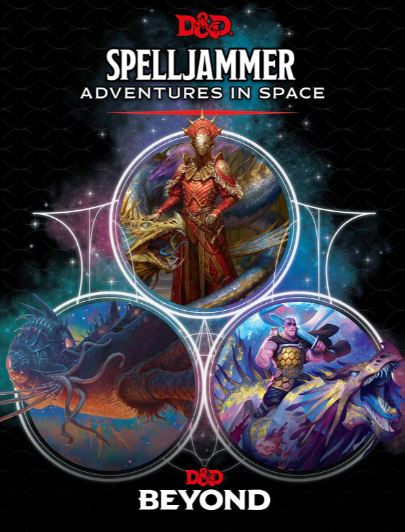

I'm running Spelljammer Academy and Light of Xaryxis for both of my gaming groups. I'm using Sly Flourish's session 0 [template](https://slyflourish.com/frostmaiden_session_zero.html) he created for his Rime of the Frostmaiden campaign to prepare. I'm going to post these prep notes for others to use. I'll update them as I run the campaign with things I learn. I'm also using SlyFlourish's [safety tools](https://slyflourish.com/safety_tools.html).

## Campaign Theme

You've applied to and been accepted by the Spelljammer Academy! In this campaign you will join the academy, pass their assessments, and traverse the stars on missions. Finally, when Faerun comes under siege from an empire in faraway Wildspace, the heroes must find the assailants and save the Realms!

## Seven Truths About Spelljamming

-   Each world sits inside a Wildspace that connects it to the Astral Sea, and the Astral Sea connects the Wildspaces of different worlds together. When you leave Faerun, you enter Realmspace, and can then travel the Astral Sea to Krynnspace, the Wildspace surrounding the world of Krynn and home to the Dragonlance setting.
-   Wildspace and the Astral Sea can be traversed using ships known as Spelljammers. Piloting such a ship requires a spellcaster attuned to the ship's spelljamming helm.
-   There are many different kinds of Spelljammers — some look like normal galleons, some are shaped like creatures like wasps and turtles, and many have even stranger shapes!
-   When a creature or object leaves a world and enters Wildspace, an envelope of breathable air forms around it and lasts until it is depleted. The smaller the object, the more quickly the air will be depleted!
-   The power of thought drives travel in the Astral Sea. The higher your intelligence, the faster you traverse the expanse, and thinking of your destination is enough to get you there without a map.
-   The Rock of Bral is a city built on an asteroid. Its cosmopolitan but somewhat lawless, with adventurers, merchants, and space pirates all rubbing elbows.
-   When a god dies, its petrified remains float out in the Astral Sea. Some have entire civilizations built atop them.

## Spelljammer Academy

Spelljammer Academy was established by the famed former adventurer Mirt the Merciless to protect the Realms from threats from Wildspace. Adventurers from across the Realms and other worlds seek to join the academy for both prestige and exciting adventures. The Academy is located well off the coast on Chult on the remote island of Nimbral.

## Your Character in the World

Your character begins at first level. You can choose any published class or race. Your character will join with companions to explore the stars. It is important you have at least one spellcaster amongst the group to operate spelljamming helms.

Additionally, your character should answer the following question: How did they learn about the Spelljammer Academy?

-   Did they learn of it from a secret organization they are affiliated with, such as the Harpers or the Zhentarim?
-   Did they hear about it from a patron? Maybe a well-traveled wizard, a connected noble, or even a vision from their patron?
-   Did they hail from somewhere outside Realmspace, and hear tells of the Academy while visiting the Rock of Bral?

## Safety Tools

**Lines**. This game will not contain physical violence towards children, unwanted sexual contact, animal abuse or cruelty, party-initiated torture, inter-party violence, or inter-party betrayal.

**Veils**. Cannibalism, mental assault, ritual sacrifice, kidnapping, consensual sex, enemy-initiated torture, or parasitic invasion will be "veiled" off-screen.

If at any time you don't feel comfortable with the content or direction of the game, say "pause for a second" in voice chat and we will stop the game and address your concerns.
