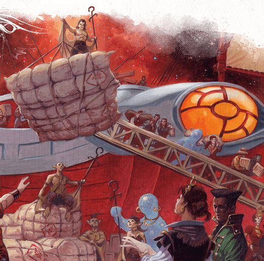

I'm running Spelljammer Academy for my two DnD groups, and I am posting my prep notes for others to re-use, and updating the posts with learnings from running the game. I'm using the template from SlyFlourish's notion.so [post](https://slyflourish.com/lazy_dnd_with_notion.html). 

Part 1: [Orientation](https://thegiantsbane.blogspot.com/2023/03/session-overview-for-spelljammer.html)

Part 3: [Realmspace Sortie!](https://thegiantsbane.blogspot.com/2023/03/session-overview-for-spelljammer_01265382499.html)

Part 4: [Behold H'Catha](https://thegiantsbane.blogspot.com/2023/03/session-overview-for-spelljammer_28.html)

Scenes

-   Breakfast
    -   Meet Petty Officer Winston Ryeback in food line
    -   Rumors
        -   Two training groups (including characters) in competitive training exercise
        -   Rash of recent thefts, especially Realmsapce charts
        -   Ryeback had his custom pistol stolen
        -   Recent attack on Mirt
    -   Share a table with Miken Haverstance
        -   DC 12 Persuasion to lift his spirits
        -   DC 12 Arcana to have conversation about spelljamming
        -   DC 12 charisma convinces Miken’s crewmates to call him over to their table
        -   Miken’s crewmates:
            -   Teyla - A halfling rogue who grew up on a spacefaring vessel before coming to the academy. She's quiet and reserved, but incredibly talented at sneaking around and getting into places she's not supposed to be.
            -   Keth - A half-orc fighter who wants to prove himself as the best warrior on board a ship. He's fiercely competitive and always looking for ways to improve his combat skills.
            -   Zarek - A gnome artificer who specializes in tinkering with magical engines and systems. He's always got a gadget or two on hand to help out in a pinch.
            -   Lyra - A human bard who loves to sing and perform. She's outgoing and friendly, and her music can inspire her crewmates to fight harder and work better.
            -   Gaius - An elf wizard who's fascinated by the mysteries of the universe. He's always experimenting with new spells and trying to uncover the secrets of the multiverse.
-   Test of Mettle - simulation test against against Miken’s crew
    -   Boatswain Tarto explains the exercise. Saerthe Abizjn explains roles:
        -   Captain - give orders, need CHA or WIS
        -   Spelljammer - pilot the ship, must be spellcaster
        -   Shipmate - rigging and weapons
    -   Simulation chambers
        -   Characters goal is to retrieve a log book and return
        -   DC 13 ability check to take off; success on first try is worth a point.
        -   Challenge 1: Plotting a course
        -   Challenge 2: Electrical Storm
        -   Challenge 3: Asteroid Cluster
        -   Salvage Operation - spot a log book amongst wreckage of a spelljammer and retrieve it.
        -   Challenge 3 again
        -   Githyanki attack
            -   One initiative per ship
            -   Gith ship stays at range
            -   2 shadows appear on round 4
            -   End battle if:
                -   enemy ship HP < 100
                -   enemy ship takes 2 criticals
                -   Character’s ship > 100 feet from enemy ship
                -   Character’s ship = 0 HP (fail the simulation)
        -   After battle, characters meet the other ship, now disabled. characters can help or leave the other ship
-   Sabotage!
    -   Simulation deck blows up when characters finish mission
    -   Tarto and Saerthe are badly injured
    -   Miken helped protect his teammates, but two are critically inured and need medicine checks to survive
    -   DC 12 investigation or perception to find metal plate with sigil jammed into wall of chamber. Tarto and Saerthe identify as signs of sabotage. Blame on Vocath.

Secret and Clues

Check off when revealed.

-   “Keep an eye out for some of these new cadets - they think the can cut it by studying all day, but it takes more than book learning to survive in Wildspace!” - a reference to Miken Haverstance in chapter 2.
-   “There have been a bunch of thefts around the academy here lately…Mirt and the bridge are letting any vagrant in the place!”
-   “Have you been to the Rock of Bral yet? Let me tell you, its the place to be in Wildspace!”
-   “I’ve heard tale of world inhabited by elves whose star is dying! Hate to be them!” - A reference to the Xaryxian Empire.
-   “It seems like Miken is nervous about something besides the academy, like something he is hiding.”
-   “Vocath is a Mercane, some kind of space giant, who has a grudge against Mirt. I hear it has something to do with an astral elf lady.“

NPCs

-   Review NPCs

-   Boatswain Tarto
-   Saerthe Abizjn
-   Mister Blip
-   Miken Haverstance
-   Petty Officer Winston Ryeback
-   Vocath

Monsters

-   [Mordenkainen Presents: Monsters of the Multiverse](https://www.dndbeyond.com/monsters/2560723-apprentice-wizard)
-   [Bandit](https://www.dndbeyond.com/monsters/16798-bandit)
-   [Shadow](https://www.dndbeyond.com/monsters/17010-shadow)

Treasure

-   If the characters win the competition, they receive 100 gp.
