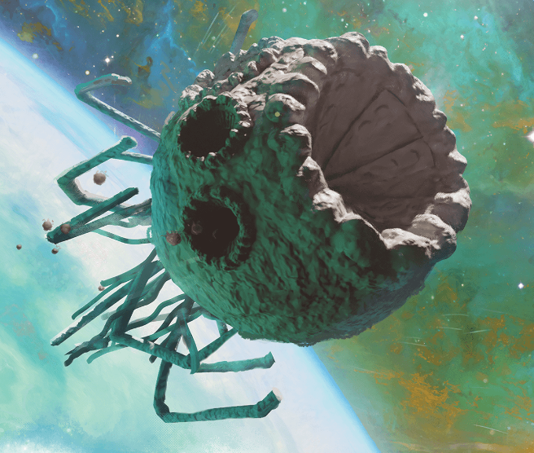

I'm running Spelljammer Academy for my two DnD groups, and I am posting my prep notes for others to re-use, and updating the posts with learnings from running the game. I'm using the template from SlyFlourish's notion.so post.

Part 1: [Orientation](/posts/spelljammer-academy-orientation-a-guide-to-running-the-adventure)

Part 2: [Trial By Fire](/posts/spelljammer-academy-trial-by-fire-a-guide-to-running-the-adventure)

Part 4: [Behold H'Catha](/posts/spelljammer-academy-behold-h-catha-a-guide-to-running-the-adventure)

## Scenes

-   Tyrant Trap!
    -   Boatswain Tarto wakes the characters and tells them they need to retrieve an adamantine meteor from a place called H'Catha.
    -   H'Catha is filthy with beholders, so characters will take a tyrant ship to sneak in.
    -   Petty Officer Winston Ryeback will lead the mission. Miken Haverstance, Krik'lit, and Pffred will act as shiphands.
    -   The Tyrant Ship
        -   Note gravity flips depending on which side of the gravity plane you are on.
        -   Make a handout of the equipment.
        -   Make sure you give the characters the ship handout, it explains a lot about getting around.
        -   Characters have to work together to get the spelljamming helm up to the command deck and installed.
        -   When characters get to the command deck, a trap activates that makes the ship spin end over end.
            -   Roll initiative.
            -   On 20, DC 15 Dex save or 7 damage and knocked prone. Half damage and no prone on a success.
            -   On character turn, they can take countermeasures:
                -   Brace: DC 15 Strength (Athletics) check for advantage on next Dex save
                -   Deactivate Trap: 10% chance to randomly deactivate by mashing buttons, or DC 20 Intelligence (Arcana).
                -   Magic: Can mitigate with feather fall, levitate
                -   Roll: DC 15 Dexterity (Acrobatics) for advantage on next Dex save.
                -   Ryeback uses featherfall on himself and NPCs.
-   Like Clockwork — deal with clockwork horrors and help an injured autognome
    -   Characters with passive Wisdom (Perception) score hear clank of metal on stone from closed hatch
    -   On hollow deck, 3 clockwork horrors are building another from autognome corpses
    -   Horrors taunt characters in thri-kreen, saying the characters brought a helm to their ship
    -   After horrors are defeated, DC 11 Wisdom (Perception) check to find an autognome with defective vocal cords named Wizpop. DC 15 Intelligence (Arcana) check to repair his vocal cords.
    -   5 100 gp pearls and a spell scroll of rope trick
-   Fire in the Galley!
    -   Miken Haverstance shows up disheveled, says there is a fire in the galley
    -   Characters have to deal with smoke — DC 10 Constitution save at start of turn or gain exhaustion
    -   Miken set the fire with a glyph of warding
    -   Characters find Ryeback's dead body, get attacked by magma mephits. Area is lightly obscured.
    -   Krik'lit and Pffred help put out the fire.
    -   Following supplies are destroyed:
        -   Portable cooking surface
        -   2 **barrels** of water
        -   5 flasks of cooking oil
        -   2 **chests** containing fresh foodstuffs
        -   1/2 cord of precut firewood
    -   DC 13 Intelligence (Investigation) to know:
        -   The fire started near Ryeback's cooking station, but the station itself couldn't make a fire that big.
        -   Likely explosion started at mephits summoned by a spell.
    -   Miken did it. Detect thoughts or DC 13 Charisma (Persuasion) check to get him to admit it.
    -   Miken was hired by a mercane whose name he doesn't know. Offered life changing gold to sabotage the mission. He didn't think anyone would get hurt. Surrenders to characters.
    -   If characters contact Tarto, she tells them to wait for backup, and she arrives the next day.

## Secrets and Clues

Check off when revealed.

-   "Keep an eye out for some of these new cadets - they think they can cut it by studying all day, but it takes more than book learning to survive in Wildspace!" - a reference to Miken Haverstance in chapter 2.
-   "There have been a bunch of thefts around the academy here lately…Mirt and the bridge are letting any vagrant in the place!"
-   "Have you been to the Rock of Bral yet? Let me tell you, it's the place to be in Wildspace!"
-   "I've heard tale of a world inhabited by elves whose star is dying! Hate to be them!" - A reference to the Xaryxian Empire.
-   "It seems like Miken is nervous about something besides the academy, like something he is hiding."
-   "Vocath is a Mercane, some kind of space giant, who has a grudge against Mirt. I hear it has something to do with an astral elf lady."

## NPCs

-   Boatswain Tarto
-   Saerthe Abizjn
-   Miken Haverstance
-   Petty Officer Winston Ryeback
-   Wizpop
-   Pffred
-   Krik'lit

## Monsters

-   [Apprentice Wizard (Miken Haverstance)](https://www.dndbeyond.com/monsters/17325-apprentice-wizard)
-   [Clockwork Horror](https://www.dndbeyond.com/monsters/2506149-clockwork-horror)
-   [Magma Mephit](https://www.dndbeyond.com/monsters/16948-magma-mephit)

## Treasure

-   5 100 gp pearls
-   Spell scroll of rope trick
