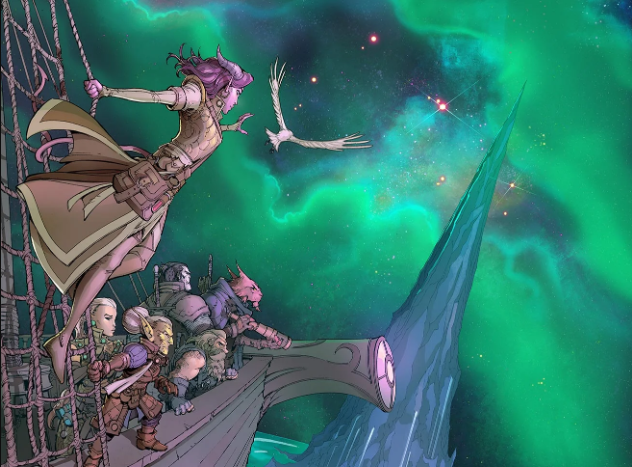

I'm running Spelljammer Academy for my two DnD groups, and I am posting my prep notes for others to re-use, and updating the posts with learnings from running the game. I'm using the template from SlyFlourish's notion.so post. 

Part 1: [Orientation](https://thegiantsbane.blogspot.com/2023/03/session-overview-for-spelljammer.html)Part 2: [Trial By Fire](https://thegiantsbane.blogspot.com/2023/03/session-overview-for-spelljammer_0999825051.html)Part 3: [Realmspace Sortie!](https://thegiantsbane.blogspot.com/2023/03/session-overview-for-spelljammer_01265382499.html)

Scenes

-   The Spindle
    -   Flighty Foundling arrives and takes Miken into custody. Boatswain Tarto and Saerthe Abizjn board the tyrant ship to join them, Saerthe as captain and spelljammer. Wizpop, Krik’let, and Pffred go with the Foundling.
    -   Takes days to reach H’Catha. When they do, show characters the art above.
    -   Tarto gives characters sending stone and bag of holding (for meteorite).
    -   Characters find where meteorite landed but no meteor, and a single pair of tracks leading from the site. DC 10 Wisdom (Survival) check to know its an ogre.
-   Spindle Cavern - negotiate with ogre and beholders over meteorite
    -   Cavern is dimly lit by cracks in the ceiling.
    -   Two spectators named Greelob and Orlob ask the characters to figure which of them should guard the meteorite. Greelob arrived first.
    -   Ogre with one eye follows a beholder named Kurrzot but is pretty lazy and disinterested.
    -   Meterorite is 500 lbs, 2 feet x 18 inches x 18 inches.
    -   Lots of options! Convince one or both spectators to go, leave it to ogre, fight them all.
    -   I found the gazers annoying to keep track of. I would recommend removing them from the encounter.
    -   You might want to have a short beholder encounter and escape. Maybe a beholder zombie gives chase as the characters leave, but its not clear its not the real thing?
    -   The Foundling flies away with Tarto proclaiming “Now for the easy part”.
-   Journey Interrupted
    -   Saerthe sees a suspect asteroid, Tarto sends characters to investigate. DC 18 Wisdom (Perception) to see a githyanki damselfly ship hiding behind asteroid.
    -   Qitru, githyanki on a starlancer, flies up and demands Miken.
    -   No Miken, inevitable fight until Qitru or the starlancer are reduced to 20 hp.
    -   If captured, Qitru admits:
        -   Qitru and her crew work for a mercane named Vocath.
        -   Vocath has several vessels looking for the tyrant ship.
        -   The damselfly ship hiding behind the asteroid has a four giff and four githyanki aboard it.
        -   Qitru has a strange tatoo that is Vorcath’s symbol.
    -   The damselfly ship will let the characters go, but surreptitiously follow them.
    -   This is a kind of weird encounter and could be omitted. As written Qitru attacks no matter what, and you need his ship to show up in the next part of the adventure. What happens if the characters decide to attack it? I think I would let him show up and not mention the ship, he can escape with invisibility. If you want to impart his information, I think that can also be done through negotiation. 
    
-   Homecoming
    -   After a night’s rest, characters are told to report to foundling in morning to swab the decks.
    -   The ship from Journey Interrupted flies overhead and drops two giff on the foundling to steal the ship.
    -   Once characters defeat giff, explosion from other side of academy.
    -   If characters go to check on Miken, encounter two githyanki carrying Miken. If they stay put, gith show up at the ship.
    -   If it is going badly Wizpop shows up to help.
    -   If one githyanki falls, the other chops off Miken’s head.
    -   Characters find tatoo with Vocath’s sigil on the githyanki’s neck.
-   Graduation Day
    -   Grad ceremony. characters told to go to neverwinter to wait assignment to a ship.
    -   Mirt gives a speech where he gives himself all the credit and blames the problems on anyone but himself.

## Secret and Clues

-   “There have been a bunch of thefts around the academy here lately…Mirt and the bridge are letting any vagrant in the place!”
-   “Have you been to the Rock of Bral yet? Let me tell you, its the place to be in Wildspace!”
-   “I’ve heard tale of world inhabited by elves whose star is dying! Hate to be them!” - A reference to the Xaryxian Empire.
-   “Vocath is a Mercane, some kind of space giant, who has a grudge against Mirt. I hear it has something to do with an astral elf lady.“

## NPCs

-   Boatswain Tarto
-   Saerthe Abizjn
-   Miken Haverstance

## Monsters

-   [Spectator](https://www.dndbeyond.com/monsters/17094-spectator)
-   [Gazer](https://www.dndbeyond.com/monsters/2560821-gazer)
-   [Ogre](https://www.dndbeyond.com/monsters/16969-ogre)
-   [Githyanki Warrior](https://www.dndbeyond.com/monsters/17149-githyanki-warrior)
-   [Star Lancer](https://www.dndbeyond.com/monsters/2506150-star-lancer)
-   [Giff Shipmate](https://www.dndbeyond.com/monsters/2771399-giff-shipmate)

## Treasure

At the end of the adventure, each character can choose one of the following:

-   [+1 rod of the pact keeper](https://www.dndbeyond.com/magic-items/11217-rod-of-the-pact-keeper-1)
-   [+1 shield](https://www.dndbeyond.com/magic-items/4753-shield-1)
-   [+1 weapon](https://www.dndbeyond.com/magic-items/5400-weapon-1)
-   [Bag of Holding](https://www.dndbeyond.com/magic-items/4581-bag-of-holding)
-   [Goggles of Night](https://www.dndbeyond.com/magic-items/4648-goggles-of-night)
