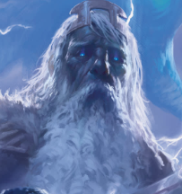

I've been DMing, playing, and reading fifth edition adventures since the launch of the edition. I decided to write some guides that DMs can use to choose their next adventure. I'll post one at a time, then tackle them as a whole at the end.

### Summary

Storm King's Thunder is a Dungeons & Dragons 5th Edition adventure for characters of levels 1 to 11. It was published by Wizards of the Coast on September 6, 2016. In this epic adventure, players are tasked with uncovering the mystery behind the disappearance of the storm giant king, Hekaton, and the subsequent upheaval among the giants. As giants wreak havoc across the Sword Coast, the heroes must travel vast distances, confront formidable foes, and ultimately restore order to the giant ordning. The adventure is inspired by G-1-2-3 Against the Giants, one of the earliest Dungeons and Dragons Adventures that was written by Gary Gygax.

### My Experience

I started a campaign in early 2018, and my group had asked me to run Storm King's Thunder. Having read it, I thought the entry level adventure designed to get to level 5 was particularly weak, so I opted to run a trek through Undermountain using converted materials from 2e and 4e Undermountain adventures. It was fairly easy to add a hook to get the characters to Goldenfields to start the campaign. We spent a lot of the campaign wandering the North and using information from Chapter 3: The Savage Frontier. I only used the Den of the Hill Giants and the Forge of the Fire Giants because I really didn't think the other giant steadings were all that great. I finished out the adventure by sending the characters through the later 5e Undermountain levels that were published while we were playing the campaign. I delayed the fight with Iymrith until later levels, and removed the storm giant help the adventure provides.

### Why You Should Run It

-   The savage frontier is a great tour of the North. You can use it in conjunction with the caravan section of Hoard of the Dragon Queen to make a great exploration adventure across the North.
-   Giants are great foes mechanically in 5e because they have a lot of hit points and do a lot of damage. That leads to harder and more exciting encounters.
-   The ordning being upset is a good through line to a campaign that I think players can follow along with. It's understandable, but also has some deep lore to dive into if it works for your campaign.
-   It's really easy to skip the parts of it you don't like. Huge chunks of the adventure can be ignored if you so desire.
-   I really like Goldenfields as a location to kick off the campaign.

### Why You Should Skip It

-   There's a lot of material I am not interested in running in the adventure. It gives a sandbox to pick and choose from, but it felt like the choices were obvious, because the quality was uneven. I thought the 1-5 adventure was a boring lead in to the real adventure. Anything involving the Uthgardt burial mounds was actively bad. I had no interest in running the stone, frost and storm giant adventures.
-   If you just want to pick up an adventure and run it from start to finish, Storm King's Thunder is just too uneven. There are a lot of better single book adventures where you have to do less work.

### What You Should Repurpose From It

Chapter 3: The Savage North is a great tool for DMs. If your party is traveling the north, it gives you just enough detail to make many locations interesting. It also really flushes out Goldenfields as an adventure hub. I think any individual giant locale is reusable to a campaign where you need it. Storm King's Thunder's greatest strength is that it does provide a bunch of really good building blocks that can be incorporated into other adventures.

## Adventure Breakdown

I'm going to start posting breakdowns of each adventure to help DMs understand the components of adventures, and hopefully give an idea of what parts of each adventure might be useful in your own campaign. I rate each chapter portability as Low, Medium, or High. Portability is a combination of how easy it would be to incorporate into a different campaign, in addition to if it's something worth running. For example, Chapter 1: A Great Upheaval, is actually fairly easy to adapt to another adventure, but I don't think it's a very good 1-5 adventure, so I rated its portability as low.

| Chapter | Adventure Type | Summary | Primary Monster | Levels | Portability |
|---|---|---|---|---|---|
| Chapter 1: A Great Upheaval | Site Based Adventure | Characters defend Nightstone from goblin attacks and investigate an attack by cloud giants. | Goblins | 1-4 | Low |
| Chapter 2: Rumblings | Role Playing | Characters gather rumors, clues and quests from various NPCs in one of Bryn Shandar, Goldenfields, or Triboar, and fend off a giant attack. | Giants | 5 | Medium |
| Chapter 3: The Savage Frontier | Exploration | Characters explore the North, following leads and undertaking various quests. | Various | Any | High |
| Chapter 4: The Chosen Path | Site Based Adventure | Characters travel to the Eye of the All-Father to hear a prophecy, and are interrupted by a dragon attack. | Various | 7 | Low |
| Chapter 5: Den of the Hill Giants | Dungeon Crawl | Characters infiltrate a hill giant lair and confront their leader. | Hill Giants | 8 | Medium |
| Chapter 6: Canyon of the Stone Giants | Dungeon Crawl | Characters explore a stone giant lair and thwart the giants' destructive plans. | Stone Giants | 8 | Medium |
| Chapter 7: Berg of the Frost Giants | Dungeon Crawl | Characters invade a frost giant stronghold in an iceberg. | Frost Giants | 8 | Medium |
| Chapter 8: Forge of the Fire Giants | Dungeon Crawl | Characters confront a fire giant chieftain in his forge. | Fire Giants | 8 | Medium |
| Chapter 9: Castle of the Cloud Giants | Role Playing | Characters visit a cloud giant castle to convince the Countess to let them use her conch of teleportation. | Cloud Giants | 8 | Medium |
| Chapter 10: Hold of the Storm Giants | Role Playing | Characters travel to the Storm Giant's undersea lair to uncover a secret threat. | Frost Giants | 9 | Low |
| Chapter 11: Caught in the Tentacles | Site Based Adventure | Characters track down cultists of a Kraken to save the Storm Giant King. | Kraken | 8 | Low |
| Chapter 12: Doom of the Desert | Site Based Adventure | Characters confront the dragon Iymrith in her lair. | Dragon | 8 | Low |
