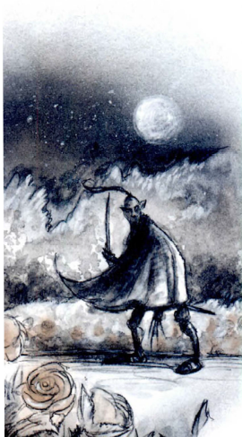

Misplaced Spirit is a short introductory adventure in the Planescape Campaign Setting. It’s meant to be a good introduction to the setting for the characters, and explain some of the key concepts of the setting - petitioners, competing factions, and the role the powers of different prime worlds play in the setting. First, let’s talk through some of the concepts of Planescape you need to know about for this adventure. I generated first drafts of these sections with ChatGPT, which did a pretty good job concisely explaining the concepts. I fact checked it to the best of my knowledge.

  

PetitionersA petitioner is the soul of a deceased individual that has been transformed after reaching the plane that aligns with their ethos, beliefs, or alignment in life.  
  
Once a soul becomes a petitioner, it loses all its memories of its past life and any abilities it may have had, and gains new characteristics fitting to the plane it has landed on. For example, a petitioner in the Beastlands may take the form of an animal, while a petitioner in Celestia would take on an angelic form.  
  
The ultimate goal of a petitioner is to achieve true fulfillment and unity with their plane - transcendence. This might mean different things depending on the plane; in the Lower Planes, for example, it might involve a petitioner being consumed by a fiend or merging into the very essence of the plane itself. Petitioners are generally reluctant to leave their home plane, since dying outside of it means a final death with no transcendence with the powers of their plane.  
  
Petitioners are a unique part of the afterlife cycle in Planescape, reinforcing the philosophical and belief-driven nature of the setting. However, until they reach their final transcendence, they can often be found living much as mortals do, sometimes in a form that fits their plane. They might serve as guides, opponents, or sources of wisdom (or nonsense) for traveling adventurers.  
  
This adventure centers on a “lost” petitioner who is instead being recruited to join a faction in Sigil. Not everything about this makes sense (this particular petitioner managed to retain their spell casting abilities somehow).  
PowersIn Planescape, The Powers is a term used to describe deities or gods. These powerful beings come from all alignments and pantheons, including those of specific racial groups like the Dwarven, Elven, and Drow gods, as well as those more widely worshipped across races like the gods of the Forgotten Realms, Greyhawk, and Dragonlance settings. They are all part of the cosmology of Planescape, residing in the Outer Planes that correspond with their particular ethos.  
  
In Planescape, belief and faith hold tangible power. This means that the Powers can wax and wane in strength based on the number of worshippers they have and the fervor of those worshippers. This tenet also forms the basis of conflicts and alliances between different Powers.  
  
Finally, while Powers are immensely powerful, they are bound by certain rules. One of the most important is that they cannot directly manifest in the city of Sigil at the center of the multiverse, which is overseen by the enigmatic Lady of Pain. Powers can also die. The githyanki’s primary home is the body of a dead god floating in the Astral Sea.  
The Celestial BureaucracyIn this adventure, The Celestial Emperor and their Bureaucracy is the primary power involved in the adventure. The Celestial Bureaucracy is a complex pantheon of gods and spirits that are worshiped in the Kara-Tur region of the Forgotten Realms setting in Dungeons & Dragons. The concept of the Celestial Bureaucracy borrows heavily from real-world Eastern philosophies and religions, especially traditional Chinese religion and Taoism.  
  

The Celestial Bureaucracy functions as a sort of divine government. At the top of this hierarchy are the Celestial Emperors, who oversee the entire universe. Beneath them are numerous deities and divine beings of various ranks and roles, each responsible for specific aspects of existence, mirroring the roles within a human bureaucracy. For example, there are deities for different locations, natural phenomena, elements, and abstract concepts.  
  
Each of these deities has a specific role to fulfill within the overall workings of the universe. The idea is that everything in the world is governed by a divine official, just as in the human world, everything is governed by a government official. Therefore, in order to ensure harmony in life and the world, it's important to pay proper respect and make offerings to the right spiritual entities.  
  
You might want to check with your players before playing the adventure as written using the Celestial Bureaucracy - there are concerns around stereotyping, cultural appropriation, and representation around the Kara-Tur setting. I’m going to write my guide to the adventure as is because I think the novelty of a pantheon the characters probably aren’t familiar with adds to the setting and the adventure. I would definitely let my table know about any potential concerns up front and pivot if anyone voiced a concern. You could easily replace the Celestial Bureaucracy with Tyr, Saint Cuthbert, Paladine, or some other deity closely related to laws and bureaucracy.  
FactionsFactions are philosophical and political groups, mostly based in Sigil, that vie for influence and power. They are also known as the "Philosophers with Clubs," for their readiness to back their ideas with force. Each faction has a particular belief system about the nature of the planes and reality itself, and their beliefs can actually shape reality in the multiverse. I’ve already posted a faction cheat sheet [here](https://thegiantsbane.blogspot.com/2023/07/planescape-factions-cheat-sheet.html).  
  
The OutlandsThe Outlands is the plane between all other Outer Planes. It is depicted as a great wheel with the other planes of the alignment spectrum laid out around it, with paths leading from each Outer Plane to the center of the Outlands, known as Sigil, the City of Doors.  
  
The Outlands are also home to a number of "gate-towns". These are settlements built around a permanent gate to one of the sixteen Outer Planes. Each town shares the alignment of the plane its gate leads to, and sometimes shifts into the plane if the town's alignment shifts too far towards that plane's alignment.  
  
The Outlands represent neutrality in the alignment spectrum, with true neutral being the alignment of the plane itself. They are home to many strange locales and beings and offer a nexus of sorts for travel and commerce between the planes.  

Dramatis Persona-   Yen-Wang-Yeh - A Judge of the Dead in the Celestial Bureaucracy, which is located in the Outlands. They are gone for a week to report to the Celestial Emperor.
-   [Faithful Servant Li](https://www.dndbeyond.com/monsters/acolyte) - Li is a minor clerk in the Palace of the Dead in the Outlands. Li traveled to Sigil to look for a misplaced petitioner. He is completely out of his element in Sigil, but desperate to find the petitioner before Yen-Wang-Yeh returns and blames the mistake on Li. Use the [acolyte](https://www.dndbeyond.com/monsters/acolyte) stat block for Li.
-   [Golden Morning Radiance](https://www.dndbeyond.com/monsters/enchanter) - Golden Morning Radiance is a lost petitioner who ended up in Sigil and has no desire to go back to the Celestial Bureaucracy, where she would be sent to Arcadia. She would rather stay in Sigil, but is still a bit confused by her entire situation. Use the [Spellcaster - Mage](https://www.dndbeyond.com/monsters/370794-spellcaster-mage) stat block to represent her.Involved Factions-   The Dustmen (The Dead)

-   Everyone is dead, some more than others. Undead have attained purity - they have purged themselves of all passion and sense.
-   Wants to recruit Golden Morning Radiance to their cabal.

-   The Mercykillers (Red Death)

-   Justice must be carried out. Perfection is the goal of the multiverse.
-   Want to capture Golden Morning Radiance and punish her for escaping.

-   The Black Cabal (The Bleakers)

-   The multiverse is without meaning.
-   Uses Golden Morning Radiance to cast minor magic for them, and wants her to join the faction.

ScenesScene 1: Faithful Servant Li  
The party runs into Faithful Servant Li just as he exits the portal from the Palace of the Dead. Since they look capable, he immediately asks them to find Golden Morning Radiance, a female half elf spellcaster petitioner who really needs to be in the Palace of the Dead. She is 5 feet tall and attractive, with long black hair. Observant characters who have a passive Wisdom (Perception) above DC 8 + Level will notice a dustman listening intently to the conversation. A passive Wisdom (Perception) of DC 10 + level will notice a Mercykiller as well.

  
Scene 2: Where has Golden Morning Radiance Gone?The party has to investigate and figure out where Golden Morning Radiance is. This is a chance for a tour of Sigil. The adventure gives you very little guidance on how to actually do this. Assuming the party is as clueless as Li, have everyone in the party roll an Intelligence (investigation) check as they begin asking random passerby for leads. They can learn any of the below information based on checks, and give the best information to the player with the highest check result, then work your way down. If you want to avoid metagaming with your group, you could make this check yourself, but I would only do that if you know your group and think they would appreciate the added confusion.  
-   DC 10 or less: New Primes should go to the Lost Hero. Someone there will help them.
-   DC 12: Rule of Three in the Styx Oarsman knows everything. If you are willing to risk going there to talk to him.
-   DC 15: Shemeska the Marauder has lots of information for sale, and she probably won’t cheat a berk like you...probably.
-   DC 18: A PC encounters a cranium rat that they can convince to go looking for Golden Morning Radiance.
-   DC 20: I heard there was someone matching that description hanging out with a bunch of Bleakers in the hive.The Lost Hero is a tavern catering to clueless primes who just showed up in Sigil. It’s full of con men, shakedown artists, and clueless primes. Tali, the tiefling bartender, has an unusually large number of piercings. Her beer is low quality but very expensive (5 gp), but you can get a commemorative mug for a mere 15 gold! It’s really a tourist trap for Primes new to Sigil I made up for the purpose of this adventure, and gives the characters another chance to roll an Intelligence (Investigation) roll against the table above if they were unlucky the first time. You can also seed later adventures hear - I gave the characters the hook to the adventure Love Letter from Well of Worlds.  
  
Rule of Three is a famous information broker at the Styx Oarsman. The characters should easily discern that its frequented by clientele from the lower plains. If the characters do talk to Rule of Three, he will happily give them information for 100 gp…or a favor to be named later of your choice. More information on the Styx Oarsman can be found [here](https://mimir.net/brix/styxoarsman.shtml).  
  
Shemeshka will see the PCs, but want them to give her new information she doesn’t have or eliminate a spy who turned traitor before she will help them. Here’s a quick summary of Shemeshka from chatGPT I cleaned up:  
  

Shemeshka the Marauder is a unique Arcanaloth (a Yugoloth variant), and one of the most powerful and influential denizens of Sigil. She's known for her cunning, manipulative nature, and extensive knowledge about the multiverse and its countless planes.  
  
Shemeshka is known for her involvement in various intrigues and plots in Sigil, using her extensive network of contacts, informants, and allies to maintain her power and influence. She is also a prolific collector of rare and valuable knowledge, which she uses as a currency of sorts in her dealings.  
  

Despite her Yugoloth heritage, Shemeshka is not outright malevolent, but rather amorally pragmatic. She's not above helping others if it serves her interests, but likewise, she won't hesitate to harm or betray others if it benefits her.  
  

If the characters bargain with Rule of Three or Shemeshka, they can give them the chant on exactly where to find Golden Morning Radiance. Similarly, if they got a result of 20 or above on one of their investigation checks, they learn her location.

   
Scene 3: Everybody was Planescape FightingOnce the party finds out that Golden Morning Radiance was seen in the Hive, they go there and find her hanging out in a flop house with a bunch of Bleakers who aren’t keen to give her up thanks to her spellcasting abilities. The characters can negotiate her release with good role playing and/or a DC 8 + level Charisma (Persuasion) check. If the players fail the check by 5 or more, the Bleakers fight to keep her. Regardless, the Mercykillers show up at an inopportune time and pronounce her a guilty escapee who must be executed. Then the dustmen show up one round later to see if they can grab her.  
  
The Bleakers are led by [Urunshu](https://www.dndbeyond.com/monsters/githzerai-enlightened), a [githzerai enlightened](https://www.dndbeyond.com/monsters/2560832-githzerai-enlightened). She is very talkative, and will spend a long time weighing the pros and cons of any decision. She has 5 [cultists](https://www.dndbeyond.com/monsters/cultist) with her.  
  
The Mercykillers are led by [Arari](https://www.dndbeyond.com/monsters/mage), a half elf [mage](https://www.dndbeyond.com/monsters/16947-mage) who hates talking, is quick to action, and is a risk taker. She is backed up by 4 [veterans](https://www.dndbeyond.com/monsters/veteran).  
  
The Dustmen are led by a [boneclaw](https://www.dndbeyond.com/monsters/93813-boneclaw) named [Amars](https://www.dndbeyond.com/monsters/boneclaw). He is a failed lich and zealous member of the dustmen since it accepted him and gave him a position of power. He has 2 [cult fanatics](https://www.dndbeyond.com/monsters/cult-fanatic) with him.  
  
I wrote this conversion for tier 3 (levels 11-15). To go down to tier 2 (levels 5-10), change Urunshu to a githzerai, change the boneclaw to a Bodak, and remove 2 cultists, 2 veterans, and 1 cult fanatic.
