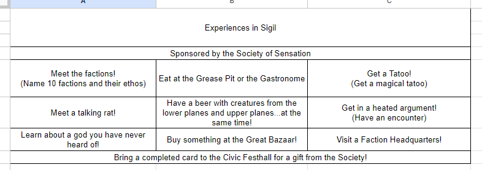

## Welcome to Sigil

The second chapter of this adventure makes the entire city of Sigil a sandbox for the characters. There isn't much structured content in the adventure itself, but there is plenty interesting to pull from the Campaign Setting to create a playground the players can explore. This section will provide some tools to structure play within Sigil, and later I will provide some scenes within Sigil you can use while the characters explore.

This section of the adventure has one glaring flaw: the characters have a central problem to solve (they don't know who they are or how they died) and no one in Sigil is going to help them (at least not yet anyway). The characters will be looking for clues, and there are none to be had. You may want to tell your characters this chapter is more about giving them a chance to explore Sigil than it is to move forward with their personal story. That said, the next two sections contain some mechanics you can use to help the players develop their characters and give structure to exploring Sigil.

In my next post I will summarize the scenes included in the adventure, and add several of my own.

## Glitches in the Multiverse

The characters are glitches in the multiverse with incomplete memories. Often, they will have experiences that remind them of one of their past selves' lives. For the characters, it is like a feeling of Déjà vu and something lost being found.

Starting when the characters emerge in Sigil, a character can experience something as a glitch that reminds them of a past life. When a player indicates that experience is a glitch, the character is rewarded with an Inspiration. If the memory involves a die roll (such as remembering fighting a previous faction as they attack a member of that faction) the inspiration cannot be used for a reroll of that action. However, a character can declare something a glitch ahead of the roll and then have the Inspiration available to them to use on that roll to gain advantage.

If a character experiences three glitches in a single level, the character unlocks a memory of the location of a cache nearby holding a trinket from their prior life as well as one of the following:

-   A spell scroll of a level the character can cast;
-   A common or uncommon potion;
-   A common wondrous item.

## Experiencing Sigil

When the characters first arrive and meet Parisa in "A Tout to Help You Out" have her give the characters the handout below. She explains that the Society of Sensation wants newcomers to Sigil to have a guide of the sights to see in Sigil. If the characters can go to/accomplish each item in the handout, they can turn it in at the Civic Festhall and receive a prize. In terms of running the game, the goal of this is to encourage players to explore Sigil in a semi structured way.

-   **Meet the Factions:** The characters should learn about at least 6 of the factions in Sigil. They should know their official name, their epithet, and their credo (ie, Athar — Who claim the gods are frauds). If you want a faction heavy campaign you can make this number higher, but it can feel like busywork if there are more than the characters can easily meet organically.
-   **See the Smoldering Corpse at its Namesake Bar:** See the scene to come.
-   **Get a Tattoo!:** Give the characters a reason to visit Fell's and learn about his magical tattoos.
-   **Meet a Talking Rat!:** Meet a cranium rat. Since this can also happen in Undersigil, this is a good one to replace if you want to encourage players to go to a specific location.
-   **Have a Drink with Creatures from a Lower Plane and Upper Plane…At the Same Time!:** This is to reinforce the neutral, cosmopolitan nature of Sigil.
-   **Get in a Heated Argument:** This is just a way to insert a combat to provide some variety, since this chapter will be very role play heavy. Some optional encounters are detailed in Scenes in Sigil.
-   **Learn About a Deity You Have Never Heard Of:** On a surface level, this introduces the concepts of gods from across the multiverse. But practically, this is here to give DMs a chance to foreshadow the god that takes center stage in chapter 15 out of the blue.
-   **Buy Something at the Great Bazaar:** This encourages the characters to visit this location. There are a few scenes that take place there in Scenes in Sigil.
-   **Spin Fortune's Wheel:** This is crossed out as Fortune's Wheel is closed for renovations. This is a chance to foreshadow the next chapter without having the characters try to go there ahead of time (hopefully).

In the next post: Scenes in Sigil!
