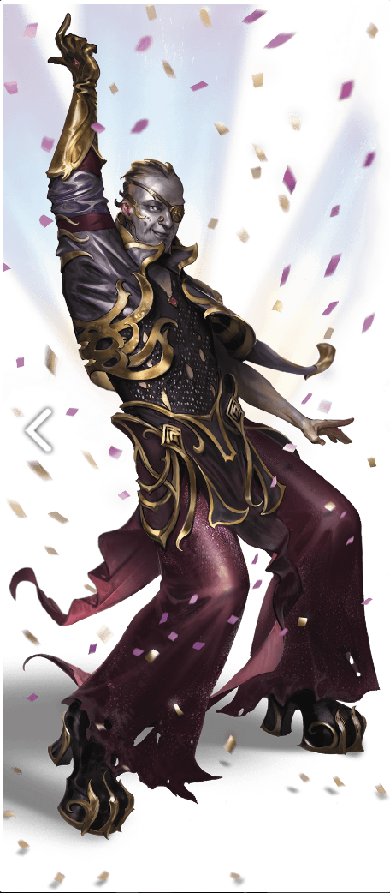

## Chapter 3: Fortune Favors the Bold

### Scene: Valek the Bellhop

Valek, a tiefling commoner, greets the characters and gives them a letter from Shemeska indicating she is providing accommodation for each of them.

-   Valek shows them to their rooms where they can tidy up a bit. Valek offers to shine shoes, tour the facility, and answer any questions the characters have, though most pointed ones he will defer to Shemeska.
-   If asked about Shemeska, he will happily surrender that she is an Arcanaloth information broker with influence across the planes.
-   Valek tells the characters they have ample time to get a full night's rest before exploring the casino.
-   Additionally, Valek should insinuate Shemeska will help them with their current situation, but the characters will need to kill time until she is available.

## Casino Map

### F1. Dragon Bar

-   Summary: Reception bar with a ghost stage magician performing and a few patrons. There is also a stairway to hotel rooms accessible via portal key.
-   NPCs:
    -   An Oni bouncer named Viz. He has no time for nonsense but welcomes the characters at Shemeska's instruction.
    -   Brayson, an equinal guardinal, minds the bar. He is taciturn but content to serve the characters.
    -   Five steam mephit cooks prepare meals for guests in the kitchen. They are a mischievous lot who don't take kindly to intruders.

### F2. Casino Cages

-   Summary: Cages to trade gold for razorvines. A welcome gift awaits each character.
-   NPCs: The imp behind the counter wears gaudy makeup and a visor. They are very friendly and welcoming to the characters, and encourage them to use their chips, and to go speak with Viz in the bar.
-   Rewards: Each character gets a satin gift bag with 10 razorvines. Additional razorvines can be purchased for 10 gp each.
-   DM's notes: The pit cage worker might remind players that the star attraction (Fortune's Wheel, area F7) costs 5 razorvines to play, so players should keep that in mind as they play the other games.

### F3. Illusory Fountain

-   Summary: Entrance to casino with statue of Shemeska.
-   Secrets:
    -   DC 12 Intelligence (Investigation) to identify that the coins in the fountain are illusionary.
    -   _Detect Magic_ or DC 15 Intelligence (Arcana) to determine the room is filled with Divination magic, and the statue is likely a scrying device.

### F4. Slot Machines

-   Summary: Characters can play a slot machine made from a repurposed Modron.
-   NPCs: A night hag named Putrice just hit it big on slots and is happy to explain how they work to the characters.
-   Rewards: Rewards if characters get:
    -   2 out of 3 numbers the same on 3d6;
    -   3 out of 3 numbers the same on 3d6 (a jackpot);
    -   A roll of 2, 4, and 6 lead to dancing duodrones and a reroll on the next 3d6 roll.

### F5. Table Games

-   Summary: Characters can play any of two different table casino style games. A mezzoloth pit boss watches over the games. The ante to play is 1 gold — the player that wins gets the pot.
-   Dead Hand's Dice
    -   Each player can roll as many d6s as possible.
    -   Everyone rolls at once.
    -   The highest result without rolling a 1 wins.
-   Olidammara's Bounty
    -   Place as many chips as desired on a number 1-20.
    -   Dealer is a d20 shaped spectator that rolls itself on the table.
    -   Roll 1d20 — if a player has a bet on the number rolled, they win five times the bet.

### F6. Big-Ticket Prize

-   Summary: Display of the Apparatus of Kwalish, the big-ticket prize from spinning the fortune wheel in F7. Joyriders get bounced by mezzoloths in 3 rounds.

### F7. Fortune's Wheel

-   Summary: Location of the namesake game of the casino consisting of three concentric wheels that get spun.
-   Spinning Fortune's Wheel
    -   Costs 5 razorvines to play.
    -   Player rolls a d10 and consults outer wheel results. If the character rolls a 10, roll 1d10 again.
    -   Consult middle wheel table for a prize. If the character rolls another 10, roll 1d10 again.
    -   Finally, consult inner wheel table for a final prize.
    -   Consult the table in the adventure for prizes.

### F8. Ice Lounge

-   Summary: A casino lounge with a sulking white dragon.
-   NPCs:
    -   Phiwi, a yeti bartender who makes the drink called the Abominable Yes Please.
    -   Winter's Bite, a young white dragon, gambled away his whole hoard except one gold coin. Worse, he has a 100 gp bar debt!
    -   If the characters don't pay the bar debt, they will have to deal with a raging white dragon when he snaps over his losses.

### F9. Stage

-   Summary: A casino stage with three performers.
-   NPCs:
    -   Bimdom Baffletrick: Gnomish illusionist with a weretiger named Felix.
    -   Estrella, silver haired elf singer.
    -   Cecila Tlapaya, ghost singer from San Citlan with a backing 10 brass piece skeletal band.

### F10. Security Room

-   Summary: Nothics look for cheaters through surveillance statues in the casino.
-   DM's Notes: Nothics can look through statues in F1b (Dragon Bar), F3 (Shemeska statue) and F7 (player's seat on Fortune's Wheel). They can direct mezzoloths to intercept unwanted or unruly guests.

### F11. Private Rooms

-   Summary: Private meeting rooms. Three hound archons play dice in one of the rooms.

### F12. Portal to the Platinum Rooms

-   Summary: Portal to the more exclusive part of the casino the characters will enter in a later part of the adventure.

## Events

### Hour 1: Identity Thieves

This scene is really silly, and I don't think it's a great fit for the flavor of a Planescape campaign I would like to run...but dnd is silly, and a lot of players will like it. Know your group if you want to run this scene. Leaving it out is perfectly fine.

Three Vecna impersonators — actually dopplegangers — walk the floor doing Vecna impressions (just use Elvis impressions). Including "Give a Lich a Hand." While one distracts the characters, another tries to pick pocket them. Characters can detect the pickpocket with a DC 16 Wisdom (Perception) check. They attack if they outnumber the nearby characters, or scatter if not. You can do a skill challenge to chase them down and apprehend them.

Some impersonator sayings:

-   You ain't nothing but a demilich, casting all the time
-   Don't be cruel…to a heart that's black
-   Love me tender, love me sweet, never let me become deceased.

And some song lyrics to the tune of All Shook Up:

Oh, well, a-curse my soul, but what's wrong with me?  
I'm lichin' like a man on a hangman's noose  
My friends say I'm stinkin' like a corpse  
I'm a lich

I'm all shook up  
Mm-mm, yeah, yeah, yeah

And to the tune of Suspicious Minds:

I'm caught in a trap  
Phy Lac ter y  
Because I wanted to live forever baby  

Why Can't I see  
What the Dark Lords Doing to me  
When I believe every word he's saying  

He won't let me live forever  
With a suspicious Mind  
And we can't build our army of the dead  
With suspicious minds

### Hour 2: Disgruntled Person

If the characters didn't pay Winter's Bite's tab, he goes berserk and attacks the current performer. If the characters don't intervene mezzoloths eventually do. A DC 14 Charisma (Persuasion or Intimidation) check gets him to stand down. If the characters make Winter's Bite stand down, I would have the mezzoloths reward them with 1 razorvine each.

### Hour 3: Shemeska Arrives

Read the box text. Shemeska asks them how the casino has been. Then asks them about their plight. If the characters find a misplaced modron named R04M, she will investigate their pasts. The modron was last seen in the outlands. It's ok to distrust her because she distrusts them — she's a fiend after all. She offers them each 300 gp to sweeten the pot.
