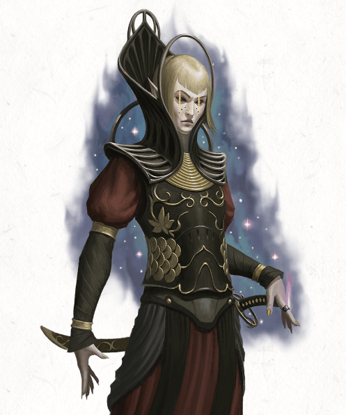

I found this chapter difficult to run. The characters are bystanders in the initial scene and have little agency to change the outcome. Then it's checking a bunch of boxes with very alien factions that the characters haven't seen before. The party's best Charisma (Persuasion) character is going to get all the limelight if you don't work hard to find reasons for other characters to be involved. In retrospect, I would have introduced some of these leaders earlier in the Rock of Bral, and others in the previous chapter. I would pick two factions with similar races to the characters to be the ones that the characters impressed in the arena, and make sure the characters get a chance to interact with them in Chapter 8.

[Guide to Chapter 8 - Arena of Blood](/posts/guide-to-running-light-of-xaryxis-chapter-8-arena-of-blood)

[Guide to Chapter 10: Space Invaders](/posts/guide-to-running-light-of-xaryxis-chapter-10-space-invaders)

-   Introduction
    -   The solar dragon is real, but Prince Xeleth is an illusion.
    -   Xeleth tracked down Xedalli using **_divination_**.
    -   Xeleth is aboard Xaryxia, one of twelve star moths surrounding Vocath's base.
    -   Vocath is mad the characters brought this drama to his doorstep and wants Xedalli to surrender to Xeleth and get out of his nonexistent hair.
    -   Read the box text of the exchange between Xeleth and Xedalli concerning the coronation.
    -   While this happens, Xedalli casts _mislead_ and communicates with the characters to let them know she dropped her **_ring of shooting stars_** in the sand of the arena.
    -   Xedalli surrenders to Xeleth.
    -   There is a "Xeleth Denied" section, but this is a railroad: Xedalli is going with Xeleth no matter what the characters do. Let them know if they are trying too hard to look for an alternative.

-   Alliance in Doomspace
    -   Vocath convenes the factions. The characters need to convince them to go to war with Xaryxis.
    -   Two factions determined by DM are friendly thanks to the characters' exploits in the arena.
    -   Must succeed at a Charisma check to convince each faction to join, dependent on faction attitude:
        -   Hostile: DC 20
        -   Indifferent: DC 15
        -   Friendly: DC 10
    -   Each time characters add a faction to the coalition, they can retry with failed factions.

    -   Hadozee
        -   Leader: Dakaer
        -   Ship: Tarrasque
        -   Summary: Doesn't want war but does want better weaponry.
        -   Gifts: Artisan's or Navigator's tools; Healing kit or **_potion of healing_**; Musical instrument; Magical weapon

    -   Aarakocra
        -   Leader: Rika
        -   Ship: Skyrra
        -   Summary: Desire freedom — looking for a Wildspace system where they can thrive.
        -   Gifts: Wildspace Orrery; Navigational chart for another system

    -   Thri-kreen
        -   Leader: T'kitka
        -   Ship: Vrusk
        -   Summary: Looking for more helms for ships and have been eating aartuks due to food scarcity.
        -   Gifts: Spelljamming Helm; 30 days' worth of food

    -   Aartuk
        -   Leader: Vortshu
        -   Ship: Remora
        -   Summary: Adversarial warmonger who picked a fight with thri-kreen, who decided they had a taste for aartuk flesh.
        -   Gifts: Dueling T'kitka; Defeating Vortshu in a wrestling match

    -   SSuran
        -   Leader: Zoth'ess
        -   Ship: Gadabout
        -   Summary: Needs gold to repair her ship and pay debts to Vocath.
        -   Gifts: 500 gp; Uncommon rarity or higher magic item

    -   If 4 factions agree to assault Xaryxis, Vocath will commit his mercane forces.
    -   Once assembled, the force heads for Xaryxispace.
    -   Read cliffhanger text.
    -   Level Up!
