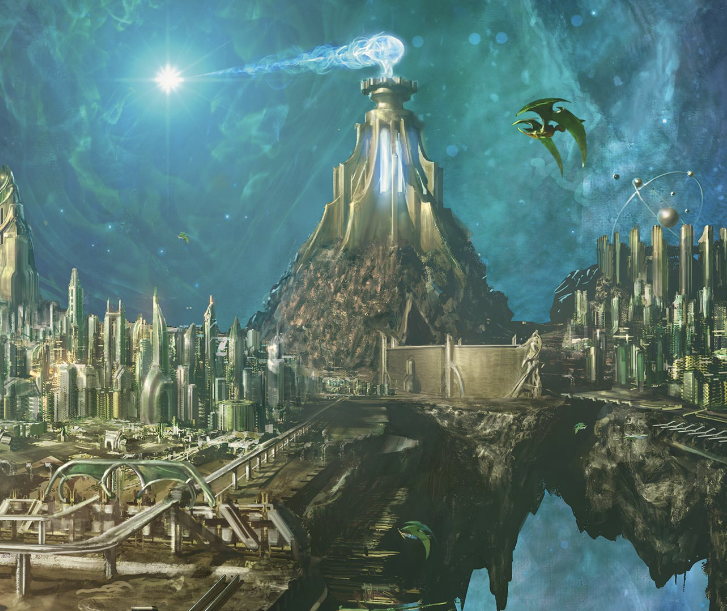

[Guide to Chapter 10 - Space Invaders](/posts/guide-to-running-light-of-xaryxis-chapter-10-space-invaders)

## Arrival at the Citadel

-   Read the box text.
-   If the characters are prisoners:
    -   A guard named Corelleth, who is loyal to Xedalli, meets the characters. He will escort them to the palace. He makes his friendly intentions clear, and can tell characters the following:
        -   Prince Xeleth's coronation will occur immediately after his father's funeral.
        -   Many wish Xeleth AND Xedalli to be coronated together, following the emperor's wishes.
        -   As emperor, Xeleth will have the characters executed.
-   If the characters are infiltrating:
    -   The characters can land at the common docks and sneak into the city.
    -   Once in the city, everyone is preoccupied with the coronation.
    -   They have time to take a short rest if they take this approach.
-   If they land at the imperial docks, they will be greeted by Corelleth.

## Temple of Light

-   Read the box text.
-   Have Xedalli look towards the characters insinuating they should speak up.
-   If they don't, she still nominates them as bearers of a ring of shooting stars.
-   Verbal sparring between Xeleth and the characters. DC 20 Charisma (Persuasion) check to sway the crowd to favoring Xedalli.
-   Depending on who loses the verbal sparring, a challenge for trial by combat.
-   Read box text where Xeleth names the zodar his challenger.

## Fighting the Zodar

-   If the characters won the verbal sparring for Xedalli, she leads a chant that gives each character 20 temporary hit points.
-   The zodar has two tactics — hit someone close to it twice and teleport them away, or teleport a squishy target far away and then hit them twice. I'd lean into the latter since characters keeping their distance probably have weaker Constitution saves.

## Aftermath

-   Read the different box text depending on if the characters defeat the Zodar.
-   On to the final chapter!
