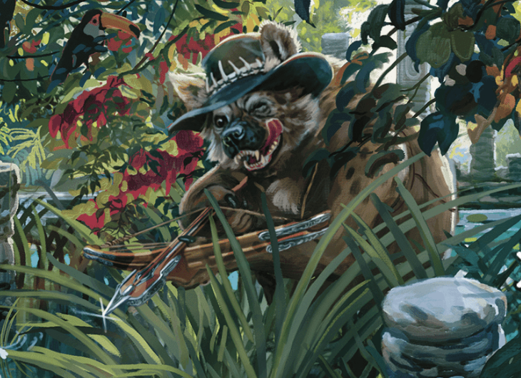

## Chapter 8: Faunel

[Chapter 7: Excelsior](/posts/planescape-turn-of-fortune-s-wheel-chapter-7-excelsior)

I'm picking back up posting my in progress guide to running Turn of Fortune's Wheel. I am planning on posting a new gate town each Sunday. I'll have an outline of information about each gate town (including anything useful from 2e) and an outline of the adventure as written with any of my own tweaks.

> "This is an ecological nightmare, and I don't know how it even works!" – A player at my table.

-   Notes about Faunel
    -   Faunel was recently absorbed into the Beastlands, so what remains is a wild area slowly starting to reorganize itself.
    -   Camp Greenbriar is a trading post where travelers intermingle with awakened beasts.
    -   Animals that drink from the water in the pool at the gate to the Beastlands become awakened.
    -   Wisdom (Survival) checks in Faunel have advantage.

-   Read the box text setting the scene, then the introduction of Razak the sloth.
    -   Some jokes Razak might tell:
        -   What do you call a fish with no eyes? Fsh!
        -   Why did the mushroom go to the party alone? Because he's a fungi!
        -   "Why did the herbalist start a band? Because she had all the thyme in the world!"
        -   "What do you call a magical owl? A hoot-dini!"
    -   Razak takes the characters to the gate to the Beastlands.
    -   The **empyrean** Wrath guards the gate. So long as the characters are honest with them, he will give them access to the gate.

-   Ravenous
    -   As the characters leave the gate, run the Ravenous encounter.
    -   Razak indicates the gnolls are part of the Vile Hunt, a pack of evil gnolls hunting animals around Faunel.
    -   Razak identifies the ibex as Oka, and suggests the characters come with him to speak to Ophelia the elephant in the Heart Delta.

-   Heart Delta
    -   Read the box text.
    -   Ophelia stays at a crater at the center of the Delta. She is an awakened **elephant.**
    -   She is sad about Oka's death but happy the characters told her.
    -   She thinks the Vile Hunt works for Ebonclaw and the predators.
    -   She thinks Ebonclaw is mad because Ophelia recently defeated him for preying on someone under her protection.
    -   She thinks Ebonclaw hired the Vile Hunt to kill Oka in retaliation.
    -   Ophelia asks the characters to go to Razortooth Rock and find out if Ebonclaw is working with the Vile Hunt.
    -   If they find out who killed Oka, she will give the characters a **_figurine of wondrous power (serpentine owl)_.**

-   Razortooth Rock
    -   Read the box text.
    -   Ebonclaw is an arrogant **saber-toothed tiger** who is mad he was defeated by Ophelia.
    -   He'll only treat with the characters if they succeed on a DC 16 Charisma (Intimidation or Persuasion) check or offer him yak meat (or some other tasty animal).
    -   If they can get him to talk, Ebonclaw is very forthcoming.
        -   Ophelia recently defeated him in a fight over a misunderstanding.
        -   He loathes the Vile Hunt.
        -   He doesn't know who killed Oka, but he thinks Parvaz at the Eagles' Aerie might know.

-   Eagles' Aerie
    -   Characters navigate through the forest to a petrified tree where Parvaz the albatross meets a variety of winged creatures.
    -   Parvaz is guarded and pragmatic. His goal is to turn Faunel into a trading crossroads.
    -   He doesn't know about Oka's death and doesn't particularly care.
    -   The Vile Hunt is ground bound and doesn't bother him or his followers.
    -   He knows where the Vile Hunt's lair is, but he won't share it without something in exchange.
    -   DC 18 Charisma (Persuasion) check to get him to talk, or can offer him Ophelia's figurine, or the promise of an item in the future.

-   Vile Hunt Camp
    -   Ophelia or Ebonclaw will offer characters 2000 gp if they go take out the Vile Hunt. Ebonclaw will supply **dire wolves** as backup and Ophelia will supply **rhinoceroses**.
    -   Read the box text.
    -   One gnoll stays back with the cage to let the Triceratops out. It charges forward and starts randomly attacking.
    -   This fight is much too easy as written. At least have the triceratops focus on the characters. I'd replace the **fang of Yeenoghu** with a **flind**. Instead of a flail, Mick wields a very long knife. I made him out to be an evil Crocodile Dundee type.
    -   Rewards: three **_potions of healing_**, 1400 gp, and a snakeskin that functions as a **_rope of entanglement_**.

-   At the end of the chapter, if he is still around, Razak will give the characters his **_ring of animal friendship_** in thanks for their help.

[Chapter 9: Glorium](/posts/planescape-turn-of-fortune-s-wheel-chapter-9-glorium)
