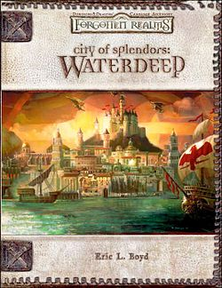

## A New Campaign

One of my groups recently finished Light of Xaryxis (I hope I never have to think about spelling that word correctly again), and with the 2024 ruleset fresh out, I demurred on trying something different (I still have my eye on you, Lost Caravan) to play another campaign I have been wanting to run - Waterdeep. I'm going to use Dragon Heist for at least part of the campaign, but I am interested in making Waterdeep the central character of the campaign and really exploring the area in and around where the characters will be located. I want to dive into my copies of old books set in and around Waterdeep for lots of ideas to flesh things out. I also want a campaign I can run when only a small number of folks are available - we'll advance the main plot when most players are present and do little side stories I seed out of random tables and character's backgrounds on the fly. Hopefully we kick it off this Sunday - thus, here is the session 0 for my players!

  

I borrowed several things in this post from SlyFlourish's excellent Session Zero for Dragon Heist, linked below.  

  

  

  

## Session Zero

## Campaign Elevator Pitch

Play a campaign in and around Waterdeep. The characters will own a business that will function as a home base and hub for adventuring. The campaign will be very friendly to players dropping in and out based on availability - we will play with as few as 2 characters. Characters will level via experience, and all characters may not be at the same level at the same time. This is an experiment to see how this works, we may revert to leveling by milestone. We will loosely follow Waterdeep: Dragon Heist for part of the campaign.

Notes about that adventure (from [SlyFlourish](https://slyflourish.com/dragon_heist_session_zero.html)):

-   _Waterdeep Dragon Heist_ is an adventure of investigation and mystery.
-   All characters should have a solid motivation to investigate mysteries with their companions in the city of Waterdeep.
-   This is an urban adventure in which you are not likely to leave the city or leave it for very long.
-   Combat takes a back seat to roleplaying and investigation.
-   All characters should have something to do in roleplay scenes.
-   All characters should have something to do in exploration and investigation scenes.
-   Key skills in this adventure include Deception, Insight, Intimidation, Investigation, Perception, Persuasion, and Stealth.

## Six Truths of this Campaign

What are the six most important things you want your players to understand about the world and the campaign? (first three from [SlyFlourish](https://slyflourish.com/dragon_heist_session_zero.html))

-   It's been five years since the end of the War of the Dragon Queen. Numerous villages, towns, and cities lost tremendous amounts of coin when raided by the Cult of the Dragon. Much of it was never recovered.
-   Due to his negligence and preferential treatment for Neverwinter, Lord Degault Neverember lost his seat as the Open Lord of Waterdeep to Lariel Silverhand, the current open lord of Waterdeep. She serves at the favor of an unknown number of Masked Lords.
-   Crime is on the rise. Numerous criminal factions in Waterdeep appear more active, going so far as to fight one another in the streets. In response, the High Wizard of Waterdeep, Vajra "Blackstaff" Safahr, has activated her independent enforcers, Force Gray and the Gray Hands.
-   Waterdeep has many guilds and orders; most people who live in Waterdeep pay dues to one.
-   Waterdeep has a large and powerful noble class. Some example noble families are the Adarbrent (known for shipping), Amcathra (different trading interests), Moonstar (Church of Selune and mapmakers and navigators), Thann (vintners), and Wands (Magecraft)
-   Waterdeep has shrines to every major god in (or underneath) the city. Major temples include the Seldarine, Gond, Helm, Ilmater, Lathander, Silvanus, Mystra, Oghma, Selune, Sune, Tempus, Tymora, Tyr, and Umberlee.
-   Waterdeep sits atop of sea cliff and a large dungeon called Undermountain. Some years back a group of adventurers traversed Undermountain and its rumored defeated its ruler, Halaster. None of the adventurers have been seen for some time though. Adventurers still descend into danger from the inn and tavern known as the Yawning Portal, some say they have began to hear Halaster’s mad cackle again.

## Character Options and House Rules

We will be using the 2024 Player’s Handbook for this campaign. Characters should use the “Core Rules” options in dndbeyond and discuss with me before choosing any Legacy items. None of the options from partnered content are available. Our goal is to try out the new 2024 ruleset. You can use the standard array, point buy, or roll (4d6 drop the lowest and assign as you wish).

## Patrons and Factions

Every character should create one NPC that ties them to Waterdeep. It could be a sibling, a spouse, a mentor, a patron, or an old flame. Most of the characters should be familiar with Waterdeep to some degree. Players will be introduced to different factions they might join through out the campaign.

## Safety Tools

Discuss what safety tools you and your players are comfortable using during this campaign. Discuss any sensitive topics to be avoided. Consult this [Consent in Gaming](https://www.montecookgames.com/consent-in-gaming/) guide for details.
