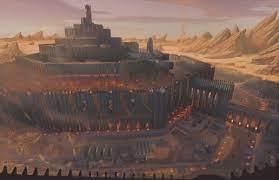

Chapter 10:Rigus 

[Chapter 9: Glorium](/posts/planescape-turn-of-fortune-s-wheel-chapter-9-glorium)

I'm picking back up posting my in progress guide to running Turn of Fortune's Wheel. I am planning on posting a new gate town each Sunday. I'll have an outline of informatin about each time (including anything useful from 2e) and an outline of the adventure as written with any of my own tweaks.

  

  
  

Notes about Rigus

-   Rigus is linked to the infinite battlefield of Acheron and ruled by six crown generals that strictly enforce rank within the gate-town.
-   New entrants to the cities are given gray badges and referred to as “slates” signifying the lowest of military ranks.
-   General Braahg, a hobgoblin warlord for Toril, is one of the crown generals. His regret for the lives lost in constant warfare is one of the few things keeping Rigus from sliding into Acheron.
-   Regional Affect: Advantage on Charism (Intimidation) checks against people of lower rank, and disadvantage against people of higher rank.
-   The populace lives in bunkers. Fetchtatter, an Arcanaloth arms dealer, frequents the bunkers looking for buyers.

The Sealed Gate

-   Read the box text as the characters approach. They won’t be able to bring their walking castle close to Rigus – a harmonium captain with fly cast on themselves flies up to stop their approach.
-   Read more box text, and town guards ask characters three questions:

-   Have you come to join the army of Rigus or proceed on to wars in Acheron?
-   What is your business in Rigus?
-   Do you have any weapons of interplanar destruction to declare?
-   If the characters answer reasonably, they get a gray badge.

-   Unfortunately, the gate to Acheron is sealed and the guards are under strict orders to restrict access to “slates” (gray badge wearers). The guard direct inquisitive characters to their commander, Major Kalar.
-   Major Kalar

-   The major is no nonsense and busy hobgoblin, but he has the chant if the characters can get him to talk.
-   The portal is closed after a series of attacks from Acheron.
-   Assaults are common but have become much better at exploiting the defenders’ weaknesses than before.
-   Kalar fears a spy.
-   He will hire the characters to find out how the enemy is getting troop information.

-   Kalar will introduce the characters to both captains:

-   Sergeant Gauller, a cambion with no idea how the enemy is getting information and paranoid that he will be targeted next.
-   Sergeant Luggik, an older woman soldier who has been replaced by a gray slaad equipped with a ring of mind shielding that renders it immune from any thought detection or mind reading magic.

-   Ettin commanders from Acheron named Zot and Sotu have the grey slaad’s control gem and are using it to gather information to prepare for each assault.
-   Reinforce the defenders at the next attack.

The Attack

-   The characters must face off against five berserkers initially, with events occurring on initiative count 0 each round.
-   Characters can take an action to make a DC 12 Wisdom (Perception) check to determine if Luggik is feigning an actual battle.
-   Once the berserkers are defeated, the characters have one round to recover. If no one noticed Luggik’s fakery, the character with the highest passive perception notices it now.
-   Three ettins attack as part of the next wave. Characters can make a DC 16 Intelligence (Arcana) check to realize the armored one wears a slaad control gem and that some slaadi can change shape. I’d make this one check rather than two. If outed, Luggik joins the battle in his true form.

Victory

-   If the characters defeat the invaders and uncover the spy, Major Kalar grants them magic items from the armory and lets them attune the mimir to the gate.
-   Potential items:

-   +1 weapon
-   +1 wand of the war mage
-   Cloak of protection
-   Dimensional Shackles

[Chapter 11: Sylvania](/posts/planescape-turn-of-fortune-s-wheel-chapter-11-sylvania)

  

#Planescape #DMsGuild #DungeonsAndDragons #RPG
