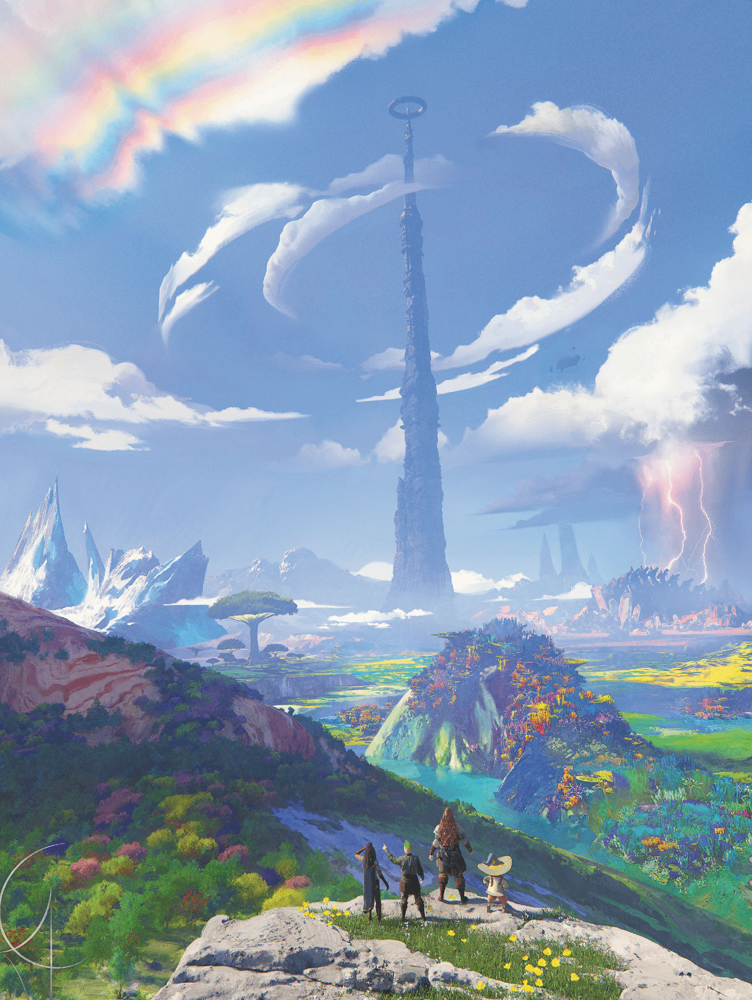

Planescape: Turn of Fortune's Wheel Chapter 12: Outlands Explorations 

[Chapter 11: Sylvania](/posts/planescape-turn-of-fortune-s-wheel-chapter-11-sylvania)

Whew, almost done with part 2! This final chapter provides some encounters in the Outlands. I've also provided brief details on the parts of adventure that aren't specifically in the adventure. 

I'm looking forward to finishing running part 2 in early November, and starting on my guide for part 3 then. I will pick this series back up at that time. 

  

  

Some notes on timing for the events:

-   After the first town, I would run the first part of the Mausoleum of Chronepsis.
-   I would run the second part of the Mausoleum of Chronepsis a town or two later, so the first scene is still fresh in the players’ minds.
-   I would save the third part until the characters are near the Mausoleum or with only one or two towns left.
-   Semaunya’s Bog can go anywhere, but as the adventure suggests, I would use it after a particularly grim town to provide an upbeat moment.
-   I skipped Angels in the Outlands because I didn’t like it – the adventure can be silly enough as is.

### Mausoleum of Chronepsis

This is a great series of encounters, but my players found it very confusing. I’ll break down the scenes and give some pointers from what I learned by running them.

-   Scene 1: Adult Time Dragon

-   I liked running this scene as soon as the characters finish their first gate-town, so it becomes clear things will be happening as they travel.
-   It begins with a heavy crash as something impacts the caste – it’s a great call to action to start a session.
-   Read the box text.
-   Renesnuprah is an **adult time dragon** that seems to know the characters, though they will not recognize her.
-   Renesnuprah doesn’t explain that she is a time traveler, though I might let a character figure it out with a DC 20 Intelligence (Arcana) check.
-   Renesnuprah leaves the characters with a **talisman of the sphere** and instructions to “Give this to the one who sees silver.”
-   Zaythir can help the characters identify the sphere if needed.

-   Scene 2: Time Dragon Wyrmling

-   I would run 2-3 more gate towns before running this encounter. My group ran a long single session, so I made sure it happened the same day as scene 1 to give characters a better chance of connecting the dots. 
-   Again, good strong start – a panicked cry from outside the castle. I guess no one in this party ever sets an outdoor watch!.
-   Read the box text.
-   An evil witch named Trikante is after this wyrmling named Renee, who is the younger version of the Renesnuprah.
-   Trikante is a great magical researcher who purchased the dragon in Ribcage. The dragon escaped and she wants it back.
-   For a little more flavor, Trikante is one of the few remaining members of a Faction known as the Incantifiers. This former faction used to be housed in the Tower Sorcerous in Sigil. Members of the faction could absorb arcane energy as sustenance. They hoard magic items and have silver pools for eyes.
-   I would make the following adjustments to the **archmage** stat block for Trikante to up the challenge and make her seem like a more unique opponent:

-   Trikante has maximum hit points (162).
-   Swap **_time stop_** with a more exotic 9th level spell the characters may not have seen – maybe **_blade of disaster_** from Rime of the Frostmaiden?
-   I’d swap **_lightning bolt_** with **_fireball_** but have her fireballs do force damage.
-   The best option for the characters is to trade her an item, and they have a legendary one from a previous encounter with Renesnuprah.

-   Here’s the catch – the box text describes Renee as _cerulean_, which means deep blue, but Renesnuprah tells the characters to give the sphere to “the one who sees silver”. This completely threw my players off. I’d replace cerulean in the description with argent, or even just silver.
-   Once the characters deal with Trikante, Renee thanks them and asks if they know where her kind comes from. A character can make a DC 18 Intelligence (Arcana) check to know time dragons come from the Mausoleum of Chronepsis. Or Zaythir can step in with the assist.

-   Renee asks the characters to escort her there when it is convenient for them.
-   Once she is taken to the Mausoleum, she asks the characters to stay back since dragons are territorial and gives them one of her scales.
-   As the characters leave, they see a massive **ancient time dragon** that tells the characters “Call, and I’ll be there”.

### Semuanya’s Bog

This encounter is a good chance to add some levity or a change of pace after one of the gate towns.

-   Meeting the lizardfolk

-   Read the box text.
-   The biggest of the lizardfolk and their spokesperson is named Sesspech.
-   The lizardfolk are celestial petitioners, meaning they have died in the mortal realm and ascended to the lands of their deity.
-   Note the lizardfolk should try to get the characters’ attention, as they are looking for a lift.
-   The lizardfolk have nearly completed a years’ long ultramarathon around the Outlands, and want a ride back to Semaunya’s Bog, home of their deity.
-   Semaunya is the god of athleticism, survival, and general physical prowess.
-   Sesspech thinks their people back in the bog should be able to help the characters.

-   Reaching the Bog

-   Read the box text
-   Sesspech invites characters to stay in the bog.
-   Characters can stay as long as they want and get as many casts of **_cure wounds, greater restoration,_** or **_reincarnate_** as they want.
-   Characters can engage in any of the contests listed while in the bog.
-   Here’s some sample reptile trivia questions:

-   **What is the only species of reptile that has a shell covering its body?**
-   _Answer: The turtle._
-   **Which reptile has the unique ability to detach its tail as a defense mechanism, which can later regenerate?**
-   _Answer: The gecko._
-   **What is the largest snake species in the world by length?**
-   _Answer: The reticulated python._

-   If the characters win 3 of the 4 games, Semaunya appears. Semaunya thinks everything is awesome.
-   Semaunya gives the characters an **_alchemy jug_** made from a green dragon skull and blooming flowers that can only produce spring water.
-   Semaunya can’t help the characters with any information.

### Other Realms

-   Caverns of Thought

-   Den of **mind flayers** and similar creatures of the Far Realm.
-   Encourage the characters to avoid this area, I don’t think there is a lot here to add to the adventure at this level.

-   Court of Light

-   The lair of Shekinister, the Three Faced Queen of Nagas. Lots of nagas come here to get information from the Arching Flame, a repository of naga knowledge.
-   There could be some value in making the characters converse with the Arching Flame, especially if it can reveal details of past lives.

-   Flowering Hill

-   This is the realm of Sheela Peryroyl, halfling god of agriculture. If the characters visit, it’s likely there will be a feast they can attend – and maybe it reminds a character of a glitch.

-   The Great Pass

-   The main route from Ribcage to Rigus. A route as unforgiving at the gate-towns. I’d have an encounter with a **bone devil** and a number of **bearded devils** to make a hard encounter given the party level.

-   Gzemnid’s Realm

-   This is a chance to foreshadow! Make sure you call it out to the characters – maybe each of them have a sense of foreboding, or a glitch or memory of the place.

-   Hidden Realm

-   Not on the map – I would only consider using it if a character had a tie to giantkin.

-   Labyrinth of Life

-   Realm of Ubtao, the father of dinosaurs. If they pass through I would have an encounter with a **Tyrannosaurus Rex.** If the characters can defeat it, they get a blessing of Ubtao that lets then summon an ankylsaurus one time for 8 hours.

-   Moradin’s Anvil

-   Dwarven mining realm in the mountains under Glorium. It produces the best weapons and armor in the Outlands, and trades with the city above named Ironridge.

-    Realm of the Norns

-   Land of divination home to a trio of reclusive seers. Characters might travel here to get glances at their once and future selves.

-   River Ma’at

-   Busy waterway for planar travelers.
-   Characters might run into a **unicorn** they knew from a former life or encounter a rampaging **hydra**.

-   The Spire

-   Use the anti-magic field near the spire to discourage characters from exploring, as they will be back here in Chapter 13.

-   Thebestys

-   Biggest settlement in the Outlands that isn’t a gate-town.
-   Founded by follower of a god of knowledge, reportedly has answers to all things in its library – they just might take several lifetimes to find.
-   Lots of philosophical debaters in the town.
-   Characters could get frustrated if they end up here and it’s yet another location where they can’t get answers. You should plant a secret for at least one of the characters here.

-   Wonderhome

-   Divine workshop of Gond, the god of invention in the Forgotten Realms. It is populated with lots of sentient constructs.

#Planescape #DMsGuild #DungeonsAndDragons #RPG
