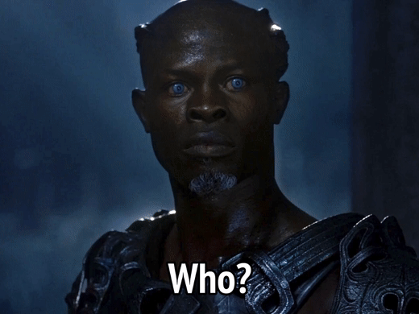

 Dungeons and Dragons Settings 101: Greyhawk

  

One of my players who is newer to DnD asked me a question recently:

  

> I find I get lost when we play sometimes when names are mentioned and I have no clue who they are. I know Strahd, I know Tasha, I know what beholders are and such. But is there a resource or a series of books I could/should read so I'm more familiar with the D&D lore?

Our group has a very mixed experience level with D&D. This reaction came from Volo showing up to give the characters a quest at the end of our session 0 of Waterdeep: Dragon Heist. But I've seen this same thing many times with mixed groups where some iconic D&D character shows up, and half the party is like "Whoa, Mordenkainen!" and the other half has this reaction:

  
So I decided to write a short summary of each setting, its main movers and shakers, and things newer players may want to know without having to surf around several wikis. I am sure I will leave some important folks out and get some things wrong, but I think I can create something good enough to be fit for purpose for new folks coming into the game. And I can always edit my mistakes later! Enough preamble - there is only one logical place to start - Greyhawk. 

Original Greyhawk Campaign

Greyhawk is predated as a setting by Blackmoor (Dave Arneson's setting that I don't plan on writing about), but for all intents and purposes, it is the first setting for Dungeons and Dragons. It started as a dungeon under Castle Greyhawk in Gary Gygax's original Dungeons and Dragons game, and eventually grew into a full fledged world known as Oerth. A number of the characters from that campaign are now iconics for Dungeons and Dragons:

-   Mordenkainen: Gary Gygax's wizard. In fifth edition, you will recognize the name from Mordenkainen's Tome of Foes and [Mordenkainen Presents: Monsters of the Multiverse](https://www.amazon.com/Mordenkainen-Presents-Monsters-Multiverse-Dungeons/dp/0786967870/ref=sr_1_1?crid=15GDIHP0YSYHB&dib=eyJ2IjoiMSJ9.mc5nbqJ4tlqlAUaial5CghhCuhuGRKzGZ0Mhv9oBVeZfHdC6O0i5DCxhPYkHWI5u9j9Bc8Y75onG7mEmHrS6JldIVOUaf7qY9WO8UrTarNNuxd8o-_KJdvhOnGvNzYOxmW9h9UcHfTjpAAan0uP8qInkSA_qFHEJLpxw2D-aumoHyc8GDoGxZSLr7fK0zcwsnN7fqKvgwJ3yG00VbgauR5PIN3OaGVFEQ8pmE4B9kM4.TrMBiSZ3p1ko_CpIntnAZIdECV2C5TCGZCNXk4kWBm4&dib_tag=se&keywords=mordenkainen%2Bpresents%2Bmonsters%2Bof%2Bthe%2Bmultiverse&qid=1726162318&sprefix=Mordenkainen%2B%2Caps%2C110&sr=8-1&th=1). Mordenkainen is a very powerful wizard. He's popped up in a couple of different published fifth edition campaigns. In Greyhawk, he founded a wizard group known as the Circle of Eight. 
-   Bigby: Famous for his spells involving projecting giant hands, Bigby was an NPC turned PC for Gary Gygax. Bigby was also a member of the Circle of Eight. 
-   Tenser: Famous for his floating disk. Another wizard member of the Circle of Eight, originally played by Ernie Gygax. Slain by Rary the Traitor.
-   Melf: Originally played by Luke Gygax, Melf is another wizard, this time famous for his Acid Arrow. Melf was an elf, and also sometimes called Prince Brightflame. 
-   Otiluke: Another wizard with many named spells, it seems he was more of an NPC than a character from Gygax's original games. He was a member of the Circle of Eight and was slain by Rary the traitor. 
-   Robilar: Played by Rob Kuntz, Robilar was a fighter. He served as the commander of Rary's forces in the Greyhawk wars. He is a grim-faced man with a goatee and dark hair and wields the Blade of Black Ice. 
-   Otto: NPC henchmen of Robilar. Another powerful wizard who was a member of the Circle of Eight. 
-   Rary: Yet another wizard, Rary was created by Brian Blume who would go on to betray the Circle of Eight in the fiction by killing Otiluke and Tenser. For this, he gained the appellation "The Traitor". There was also apparently an in-joke where he was referred to as "Medium Rary". Famous Villians from Greyhawk

-   Vecna: You know, the bad guy from Stanger Things. In some ways, Vecna is the original Big Bad Evil Guy of Dungeons and Dragons. Vecna starts as a mortal in Oerth, becomes a lich, and is defeated by his lieutenant, Kas, leaving behind the Hand and Eye of Vecna. Vecna eventually returns and ends up trapped in his own Domain of Dread in Ravenloft. He manages to escape and hatches a plot to usurp the Lady of Pain in Sigil and at this point becomes the multiversal threat he is in 5e. If you really want to go deep, read this [explainer](https://whatdoiknowjr.com/2024/09/22/what-do-i-know-about-vecna-multiversal-threat-and-king-of-tangentially-associated-artifacts/) at What Do I Know. 
-   Iggwilv: Created by Gygax, Iggwilv first appeared in The Lost Caverns of Tsojcanth. Iggwilv authored the Demonicon, was the Witch Queen of Perrenland, was the lover and captor of the demon lord Graz'zt, and their child is the demigod cambion Iuz. Iggwilv is also Tasha of Tasha's Hideous Laughter and Tasha's Cauldron of Everything fame. In 5e,  her history was updated to indicate Tasha was the adopted daughter of Baba Yaga who eventually became Iggwilv the Witch Queen. Tasha is her implied good personality, and Iggwilv is the evil side. 
-   Iuz: Iuz is a demigod of Deceit, Pain, Oppression, and Evil in Greyhawk. He appears as an old man or a hulking demon. Iuz has spent time trapped under Castle Greyhawk and imprisoned within Vecan as part of his rise to godhood. When he wasn't trapped, he started the Greyhawk Wars and ruled over an empire in central Oerth.
-   Lolth: Lolth was also created by Gygax and made her debut in the Q series of modules, culminating as the primary villain in [Queen of the Demonweb Pits](https://www.dmsguild.com/product/17054/Q1-Queen-of-the-Demonweb-Pits-1e). She is the drow god of spiders and just generally being evil. Her origin myth is that she was originally a member of the Seladrine (elven pantheon) who was cast out for betrayal. She was probably most popularized as the same god in the Forgotten Realms thanks to her ties to the Driz'zt Do'Urden novels, but she was always a big force in Greyhawk as well. 
-   Acererak: The demilich who created the Tomb of Horrors to bedevil adventures (and players) everywhere. Acererak was born a cambion with a Balor father. Acererak may have been an apprentice to Vecna, and he served Orcus up until he achieved lichdom. Then he created his Tomb of Horrors. In 5e, he shows up as the main villain in Tomb of Ahnihilation. 
-   Tharizdun: A dark, secretive god of Eternal Darkness, Decay, Entropy, and Malign Knowledge. He's featured in The Temple of Elemental Evil, has popped up as a mysterious villain in many different settings and adventures, and is sometimes called the Chained God. In 5e, the elemental cults in Princes of the Apocalypse are trying to free Tharizdun. I like him best as an unknowable threat of inconcievable evil. 
-   Kyuss - The Worm That Walks. Kyuss is a demigod of worms, undeath, and corruption. Kyuss created his worms, foul parasites that burrow into their human hosts and turn them into worm-filled Spawn of Kyuss. It's rumored he achieved godhood by mass slaughtering his followers. He's also the main villain of the adventure path Age of Worms from Dungeon magazine. 

Famous Adventures Set in Greyhawk

I'm going to briefly mention the adventures here, and link their fabulous histories on DM's Guild by Shannon Applecline. I'd suggest giving those a read, I always find them interesting and enlightening!

-   [Tomb of Horrors](https://www.dmsguild.com/product/176871/S1-Tomb-of-Horrors-1e): Gygax's famous PC killing dungeon. It has appeared in some incarnation in every edition of the game. It was reproduced in 5e as part of Tales from the Yawning Portal. 
-   [White Plume Mountain](https://www.dmsguild.com/product/17064/S2-White-Plume-Mountain-1e): Prevent the evil wizard Keraptis from achieving his dreams of immortality underneath the volcano named White Plume Mountain. I personally prefer the 20th anniversary update, [Return to White Plume Mountain](https://www.dmsguild.com/product/17404/Return-to-White-Plume-Mountain-2e). In fact, I have a [5e conversion](https://www.dmsguild.com/product/383936/Return-to-White-Plume-Mountain-5E-Conversion) on DM's Guild!
-   [The Temple of Elemental Evil](https://www.dmsguild.com/product/17068/T14-Temple-of-Elemental-Evil-1e): A famous dungeon crawl created by Gygax. I really recommend reading the history on this one!
-   [The Sinister Secret of Saltmarsh](https://www.dmsguild.com/product/17069/U1-The-Sinister-Secret-of-Saltmarsh-1e): This kicks off a series of adventurers in and around Saltmarsh featuring aquatic foes. Many of these adventures were recreated in 5e in the adventure Ghosts of Saltmarsh. 
-   [Against the Giants](https://www.dmsguild.com/product/17037/G13-Against-the-Giants-1e): Actually a series of three adventures (G1-G3) that pits the characters against increasingly powerful giants around the country of Geoff. An inspiration for 5e's Storm King's Thunder. D1-D3 Queen of the Spiders is a follow-up once it is revealed that it was the drow that were riling the giants up.
-   [Expedition to the Barrier Peaks](https://www.dmsguild.com/product/17065/S3-Expedition-to-the-Barrier-Peaks-1e?term=barrier+peaks): Also set near Geoff, this adventure is a wild genre mash up where the characters find a crashed spaceship and get laser guns. Pew Pew! It is updated to 5e in Quests from the Infinite Staircase (along with Lost Caverns of Tsojcanth). 
-   Age of Worms: The second adventure path published in Dungeon magazine during third edition, it features Kyuss as the big bad. It sits at the top of my bucket list of adventures to run - with Greyhawk coming in the 2024 Dungeon Master's Guide, it might finally get its turn. 

Deities of Greyhawk

Here's a quick list of some of the more famous dieties of Greyhawk not mentioned elsewhere. They come from different pantheons, but all are worshipped widely. I've probably left out an important one or two, but these are the ones that I think are most common. I've linked a Wikipedia page with all the gods in my sources. 

-   Boccob, Neutral god of magic and all things arcane. 
-   Celestian is the good god of the stars.
-   Ehlonna is the neutral god of the forests.
-   Fharlanghn is the god of travel and the road.
-   Hextor is the evil god of war and discord.
-   Kord is the neutral god of athletics.
-   Nerull is the evil god of those to seek to enrich themselves, with some necromancer vibes.
-   Obad-Hai is the neutral god of beasts, nature, and hunting
-   Pelor is the good sun god. 
-   St. Cuthbert, Good god of wisdom and dedication.
-   Wee Jas is a goddess of magic and death. 
-   Zagyg is the god of humor, occult lore and unpredictability. 

Further Reading

An excellent [map](https://greyhawkonline.com/ghmaps/) of Greyhawk. 

  

I've not read many of the setting books for Greyhawk, but the one I have read a good chunk of is the [Living Greyhawk Gazateer](https://www.dmsguild.com/product/28492/Living-Greyhawk-Gazetteer-30?term=Greyhawk+Gaz). I believe it was the last setting-style book published for Greyhawk. It is a good summarization of the world. As an aside, Living Greyhawk was an organized play initiative where Oerth regions were mapped to real world regions, and if you played in D&D organized play, you had to play in the region mapped to where you were playing. I only got to play a couple such games at Gencon, but I always thought it was a fascinating concept. 

  

If you would like to hear more about either of these topics, Mastering Dungeons has been doing a walkthrough of the Gazateer and reminiscing their experiences playing in Living Greyhawk on thier podcast starting with this [episode](https://www.youtube.com/watch?v=hUVkMtD0Wq8). 

  

Next up: I'm going to try to do this for the Forgotten Realms. The Realms is a very expansive setting, so hopefully I don't run out of digital ink...or time!

Sources:

-   [Greyhawk's Wikipedia article](https://en.wikipedia.org/wiki/Greyhawk)
-   [Greyhawk fanon wiki](https://greyhawk.fandom.com/wiki/Mordenkainen)
-   [ghwiki](https://ghwiki.greyparticle.com/index.php/Melf)
-   [Living Greyhawk's wikipedia article](https://en.wikipedia.org/wiki/Living_Greyhawk)
-   [Greyhawk Online](https://greyhawkonline.com/greyhawkwiki/Robilar)
-   [Wikiproject Dungeons & Dragons](https://wikiproject-dungeons-dragons.fandom.com/wiki/Rary)
-   [List of Greyhawk Deities](https://en.wikipedia.org/wiki/List_of_Greyhawk_deities)
