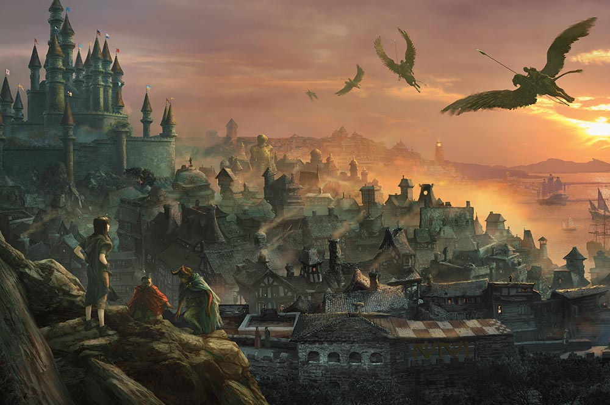

Introduction

I'm ten sessions into a Waterdeep: Dragon Heist campaign. So far, it's been great fun. Here is my [Session 0](https://thegiantsbane.blogspot.com/2024/09/waterdeep-dragon-heist-session-zero.html) for the campaign. If I were to amend that based on what I have learned so far, I would add the following bullet points:

-   Waterdeep is the campaign's central character. A goal of play is to learn about the city and its unique characteristics, especially its rulership, guilds, and factions. 
-   Each character will join a faction, and completing quests for factions will provide renown and perks for the characters.
-   You will quickly reach third level, and then spend many sessions advancing from third to fourth, and fourth to fifth level. The goal is to spend time getting to know the city and give each character time to gain renown in their respective faction. 
-   You will have an opportunity to run your own business in Waterdeep. At early levels, gold will be scarce and important for operating that business. 
-   The Guilds of Waterdeep have immense power - you might be able to negotiate with them, but it will be very hard to open your business without paying for their services. 
-   Someone should play a wizard. The class is very ingrained into the culture of the city via the Watchful Order of Magists and Protectors, and playing a wizard will be fun, especially if you want to collecting spells. 

Notes on Running the Adventure

-   Give much more gold early than the adventure calls for. It is nearly 1500 gp for the characters to be able to open Trollskull Manor as a tavern - that takes a while at low levels. I'll note using the 2014 DMG treasure rules made it much more slow doing than the 2024 DMG treasure rules that I switched to once it came out. The 2024 DMG suggests a lot more gold per encounter.
-   Don't forget about the holidays - they really give the city flavor, and the players a chance to explore their characters. Track the date meticulously. 
-   I let the characters choose their season, and told them it had an impact on the story, but no more than that. They chose winter, so I am going to use Manshoon as the villain...but I like the Cassalanter arc enough I am going to pull it in as well. To that end, I am having a lot of early side treks and encounters with generic cultists who summon fiends, with the intent to tie it back into the Cassalanters later. Regardless, the players are well aware of the conflict between the Zhents and the Xanathar Guild.
-   I am leaving everything with Jarlaxle out of the adventure. I probably would have pulled him in if there was a drow NPC, but without that its just not worth the additional complexity given how much I am including. 
-   I'm using a 1:1 mapping of characters to factions, except the Grey Hands that the entire party joined. I've added the Watchful Order of Magists and Protectors as a faction for the wizard in the group to join, and left out Bregan D'aerthe. This adds a lot of fairly low stakes adventuring content to the adventure, but so far my players have greatly enjoyed it. It very intentionally moves the spotlight from character to character each session, and makes dealing with missing players a little easier. 
-   I'm still not sure how I am going to handle the amount of gold the characters can get from the end of the campaign. I have some ideas, but they all feel like cheating the players. I'm sure there will be a post on that down the road, but I am just running the game and trying to set the stage for debts or opportunities to manage that problem when I get to it. 

Resources

-   [Durnan's Guide to Tavernkeeping](https://www.dmsguild.com/product/254715/Durnans-Guide-to-Tavernkeeping) is the best resource I have found for expanded rules around running Trollskull Manor. It also has useful details for random taverns in general. 
-   [Waterdeep: City Encounters](https://www.dmsguild.com/product/251816/Waterdeep-City-Encounters) is a fantastic resource for quick encounters in Waterdeep. 
-   [Waterdeep: City of Splendors](https://www.dmsguild.com/product/25995/City-of-Splendors-Waterdeep-35) by Eric L Boyd is a book I read cover to cover and often refer to as I put my campaign together.
-   SlyFlourish's notion.so [template](https://slyflourish.com/lazy_dnd_with_notion.html). I've used it for a while, but its really useful for a campaign with a lot of recurring locations and NPCs. Contact me directly if you would like access to it - there is a lot of character specific information, but I would guess 75% of what I have populated is reusable across Dragon Heist campaigns. 
-   I am not publishing it since it uses proprietary files, but I made a custom GPT at [chatgpt.com](http://chatgpt.com) and provided it some of the resources above. I can then chat with it while DMing to get encounters, NPCs, and other random bits of information on demand.  Its incredibly helpful and a big time saver. A future post will be a side trek adventure I created an outline for and then let my GPT flesh out. While I don't think the writing is all that great, it definitely saved me time and made the skeleton of what I put together better. 

## Inspirations

Here are several inspirations for this campaign:

-   Sam Sorenson's [In Praise of Legwork](https://samsorensen.blot.im/in-praise-of-legwork) is the inspiration for what I wanted my Waterdeep campaign to be. I never expected it to be as detailed as _City State of the Invincible Overlord_, but I did want that to be an aspiration to strive towards knowing the closer I could get to it, the better the campaign would be. Shout out to [Graham Ward](https://www.darkplane.com/) for pointing me to this blog post. 
-   Sly Flourish's [posts](https://slyflourish.com/dragon_heist_chapter_1.html) about preparing Dragon Heist. 
-   MerricB's [musings](https://merricb.com/category/dd-2/waterdeep-dragon-heist/) about Dragon Heist.
-   All the folks in the [Mastering Dungeons](https://www.patreon.com/c/MasteringDnD/posts) discord. Its a great community for learning and inspiration, 

What's Next?

-   Detailed locations in Trollskull Alley
-   A side trek adventure using the Dwarven Forge Watchtower
-   Posting play summaries from the campaign.
-   Let me know in the comments if there is anything else you would like to see!
