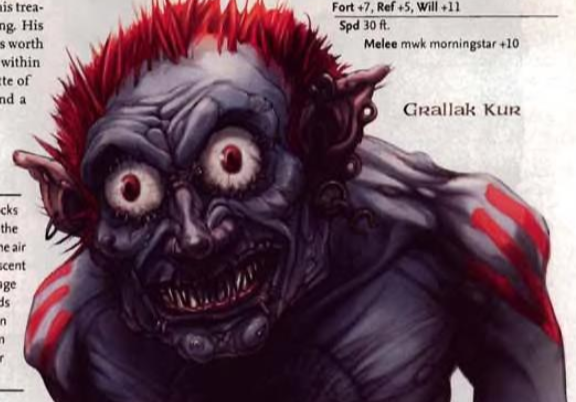
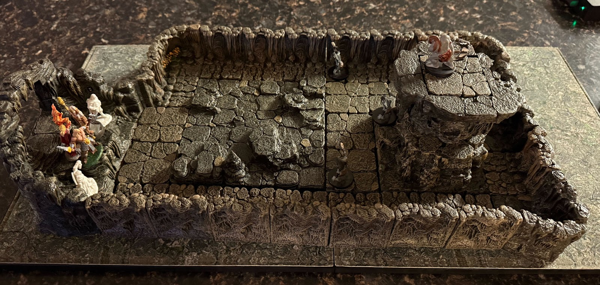
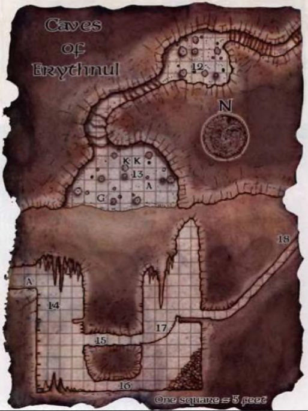

  See my review of the first adventure, The Whispering Cairn, [here](/posts/review-of-the-whispering-cairn-from-the-age-of-worms-adventure-path). 

## Initial Thoughts

A quick search will turn up several lackluster (informal) reviews of this adventure, calling it the weakest of the path. So I went in with low expectations and expecting to need to do some work. On the other hand, this adventure is written by Mike Mearls, whom I have boundless respect for as the architect of 5e. He blew my mind multiple times at a panel at GameHole this year - I really wanted to ask him about this adventure, but didn't get the chance. 

I ran this adventure over 6 2-3 hour sessions with a group I have gamed with for decades. We played hybrid, half remote and half in person, using Vorpal Board. Miniatures, maps, and Dwarven Forge were used in almost all encounters. Most, but not all of the players are tactically minded and make optimized choices. I removed several extraneous encounters to focus on the more interesting encounters, almost all of which I discuss below. 

## Strong Start

One of the top critiques online is of the adventure hook. It's basically a major NPC, Allustan, pointing the characters at the dungeon that makes up the majority of the adventure. I took the advice of one of the threads on the Paizo forums ([link](https://paizo.com/threads/rzs2hgo1?Advice-for-Three-Faces-of-Evil)) and threw the characters in jail. Balabar then showed up and flexed his power in town and forced the characters to go deal with the cultists who had compromised him. As I was preparing this, SlyFlourish posted [Avoid Removing Player Agency](https://slyflourish.com/avoid_removing_player_agency.html) that clearly said, "Don't capture your characters." I did it anyway, but I told the players what I was doing and to treat it cinematically. It worked well as an introduction to a campaign villain and a forceful hook into the adventure. I think this works well so long as you telegraph what you are doing to your party. It is also much safer if you know your players well, which I did. 

## Adventure Structure

There's no way around it: This is mostly a dungeon crawl. But it's a pretty good dungeon crawl in my estimation. It starts with a hook, then the party finds a way into the mine, and finally enters the dungeon and chooses one of three evil gods' temples to tackle. 

My party went completely sideways from what the adventure expected to enter the mine. The dwarf in the party had a tie to Ragnolin (the mine owner) and went to visit him at home. They quickly figured out he was somehow charmed or mentally influenced and went to the largest clergy in the area to look for a _remove curse_ or _greater restoration_. They ended up getting help from the cult-like church of St Cuthbert. A mob of followers followed their priest to Ragnolin's home, where he cures the dwarf. The characters then travel to the mine with Ragnolin, who gives them free rein to enter. 

Once inside the dungeon, there is heavy foreshadowing of the final boss in the first room, and a running guard to encourage the party to choose a particular dungeon to go to first. I'm lucky in that my group leans into hooks - I know many would do anything but follow the obvious hook. If they don't, it wouldn't be a big deal, but I think it tells a tighter narrative of the nature of the three distinct cults if they do. On to the dungeon...

## The Dungeon

The Dark Cathedral

The first dungeon is The Dark Cathedral, populated by the followers of Hextor, god of war. As such, it is very regimented, with detailed rules for how the denizens will react to the parties' incursion. The first encounter sets this up well - eight skeletons in full plate to lock down the party while really weak cultists flee to alert the rest of the compound, and two veterans in the next room who also come out to engage the characters. Some of the cultists break off to release a trained dire boar to add to the encounter. It's a great encounter because the characters have a lot of interesting tactical choices that have ramifications on the encounter difficulty. In my case, the characters let the cultists get away, so they had to deal with the boar, but were able to lock the veterans in their room and keep them out of the fight until they dealt with most of the other threats.  Once they finished that encounter, there was basically one more. They had a choice of entering an unlocked door or trying to bash down a barred door that was clearly strongly secured. They chose the path of least resistance, which in turn led to a tough battle on the Hextorites' chosen ground. Zombies, cultists, and clerics of Hextor with the high ground led to a dynamic and challenging battle. 

The Caves of Slaughter

The second dungeon is the Caves of Slaughter, filled with bloodthirsty grimlocks who follow Erythnul. I cut several encounters, such that there were really three major fights. A very cool ambush while the characters first descend to the caves, a battle royale with the grimlock chieftan and the bulk of his forces, and finally a showdown with the high priest of Erythnul, this guy:

  
Most grimlock art depicts them as void of eye sockets, but this art is worth going against canon any day of the week! It also let me break out one of my favorite pieces of Dwarven Forge, the [Stairway to Violence](https://dwarvenforge.com/products/6-a197-p_stairway-to-violence-painted?srsltid=AfmBOor9-5ZpmY4O70vaJVGOOcqhHbxryTQr0_t9pTxb3o_k9NNZ_9nW). I used the **grimlock brute** and **grimlock shaman** monsters from [Monster Manual Expanded](https://www.dmsguild.com/en/product/267678/monster-manual-expanded-5e?keyword=dungeon%20124) and it made for a good tactical encounter, with the shaman using higher ground and controller spells to lock the characters in a battle with the brutes. Here's a picture of the build:

That said, I want to circle back to the very first encounter in the Caves, the aforementioned ambush. Here's the map included in the adventure:

  
It took me at least an hour over several prep sessions to figure this damn map out. The top half of the map is a top-down view of the ledge and area leading up to the top left corner of the bottom half of the map. The bottom half of the map is a side view of the entire encounter area. The gameplay loop is combat on the ledge, then climb down and be attacked while doing so by archers hiding in the top tunnel. Once you reach the cavern floor, a brute charges out from the bottom tunnel to engage while the archers pepper the characters from above. At third level the characters didn't have many tricks to make this encounter easy - it was a great tactical challenge. But wow, was it hard to get that map figured out so I knew how to run the encounter. There is a rope bridge on the back side of the middle tunnel that continues on into the caves. I removed chokers and additional grimlocks on the back ledge as my PCs were pretty wiped, and this was the first of three encounters. This part of the dungeon was good, but required a lot of work.   
The Labyrinth of Vecna

The last of the dungeons is the Labyrinth of Vecna. It is, in fact, a claustrophobic labyrinth of interlocking passages filled with secret doors. I dropped the characters into rounds and had them start exploring. As soon as the characters got a little far apart, I had two different groups of kenku attack from different directions. This turned into a satisfying tactical fight, particularly because I used two **kenku duelists** from [Monster Manual Expanded II](https://www.dmsguild.com/en/product/293658/monster-manual-expanded-ii-5e?term=Monster%20Manual%20Expan) in addition to run-of-the-mill 2024 **kenkus**. The kenku's _fairie fire_ ability (**Eldritch Lantern**) was a great complement to the Duelist's sneak attack, especially in the narrow corridors that made it hard for the players to pile on one enemy. Several characters went down, and one nearly died. After the challenging fight, I let the character simply navigate through the rest of the labyrinth as I felt another encounter with kenkus would be anticlimactic. 

  

Once they finally reached the temple of Vecna, the Faceless (their leader) was happy to parley. This didn't seem expected in the adventure, but after so many murderous combatants, the negotiation felt like a great change of pace. Eventually, the priests negotiate their escape under the cover of an allip that attacks the characters. Since the Faceless One escaped, I decided to not have the Ebon Aspect appear - I might make it happen later opportunistically. I certainly expect the Faceless One to show back up. 

## Conclusion

The Three Faces of Evil is mostly a dungeon crawl, but it's a pretty good dungeon crawl. It is certainly linear, and that might frustrate some games, but each dungeon could be encapsulated as one good session that had at least one very interesting tactical encounter. My biggest complaint is a poor battle diagram in one of the interesting encounters. But if you have a group that wants to do a challenging, heavy combat-focused dungeon crawl, I strongly recommend the Three Faces of Evil.
