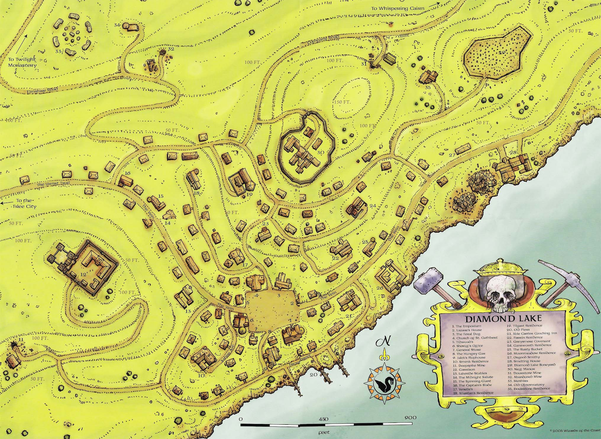
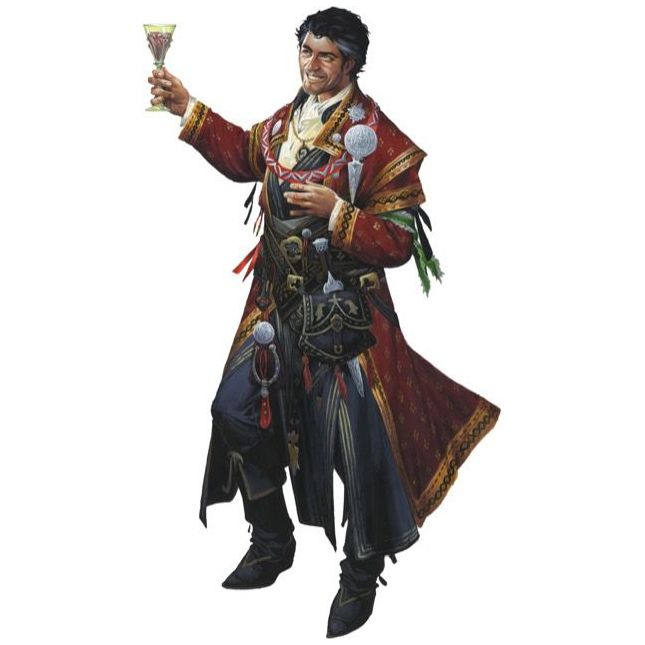
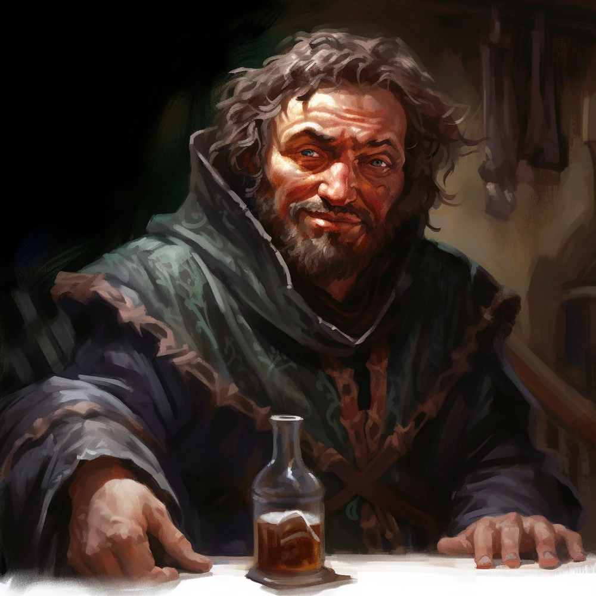
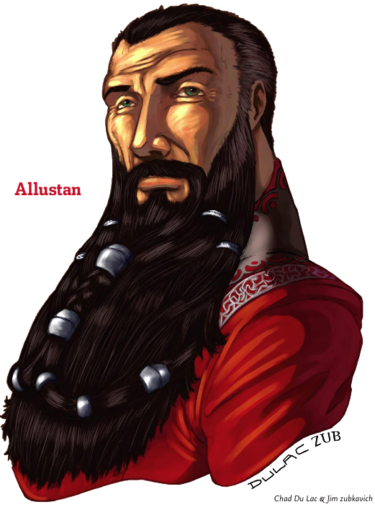
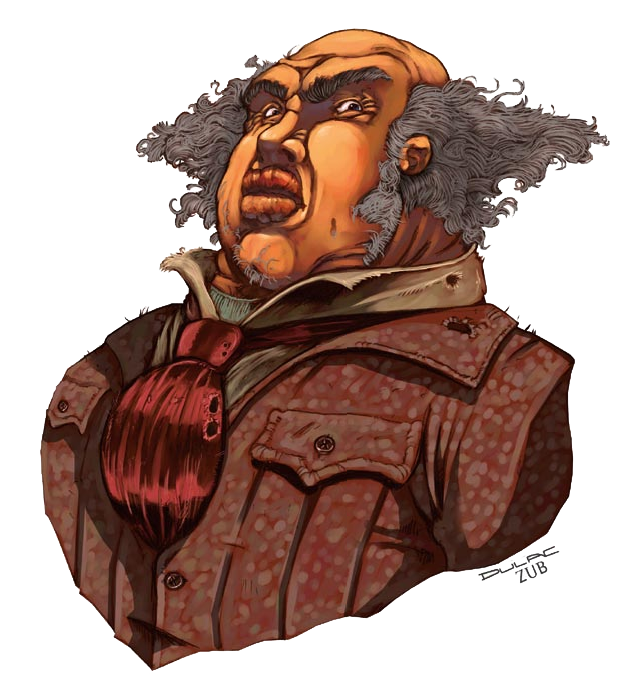
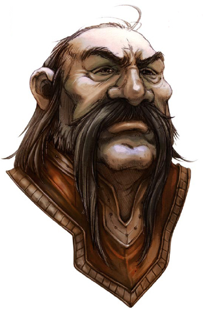
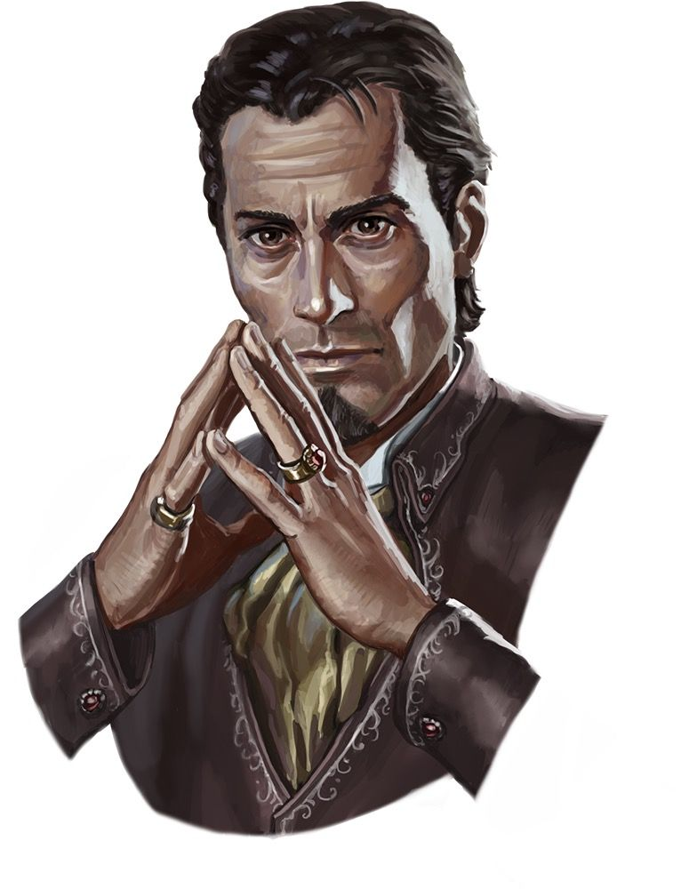
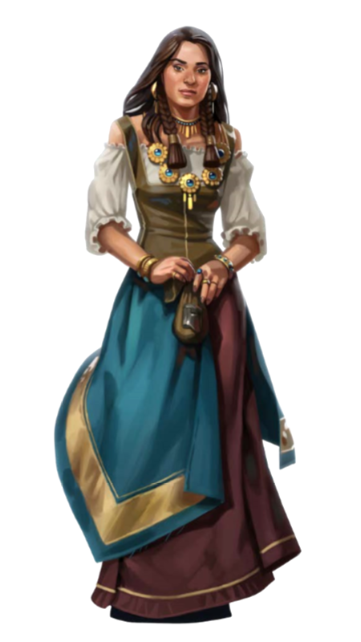

## Diamond Lake: A Greyhawk Mining Town

This post shares the basics about Diamond Lake and is written to be shared with players visiting the town. I created it for my Age of Worms campaign, and am sharing it here in case it helps others. 

### History

Diamond Lake began as a treasure seeker's outpost, as many cairns dot the surrounding hills. Those treasures were all gone decades ago. For a while, the town became a sleepy fishing town until the mines opened for Greyhawk and polluted the lake. It has remained a hard-bitten mining town for decades now. The work is dangerous and difficult, luring only those in the most desperate of circumstances. Greyhawk installs a Governor-Mayor, but the town is mostly run by the managers of the most lucrative mines.

  
  

### NPCs

#### Governor-Mayor Lanod Neff

The main agent of the Free City in Diamond Lake is a lecherous philanderer who prefers to ignore problems until they go away.

#### Sheriff Cubbin

  
  

The Sheriff is Smenk's right hand and enforcer. He is famously corrupt.

#### Allustan

  

Neff's brother, a wizard who retired to Diamond Lake five years ago. His reputation as a powerful wizard with deep connections to important personages in Greyhawk helps keep Neff in power.

Mine Managers

**Balabar Smenk**

  

A relative newcomer, Balabar seeks to monopolize mining in town by driving his competitors out of business, then buying their mines for a song.

**Ragnolin Daggerstone**

Ragnolin moved here 50 years ago from the Dwarven community of Greysmere, and has a successful ore mining and smelting operation.

**Chaum Gansworth**

The newest mine manager, Chaum is in an (for his part) uncommitted relationship with Luzane Parrin. He's highly pragmatic and skeptical of the other mine managers' ability to stand up to Smenk.

**Ellivel Moonmeadow**

Ellivel Moonmeadow leads a small contingent of elves in Diamond Lake who operate a silver mine. They hold themselves well above the common folk of the town.

**Gelch Tilgast**

Gelch Tilgast was foremost amongst the mine managers until Smenk showed up. Now he is trying to build a tenuous alliance with Chaum, Luzane, and mine managers from nearby towns.

**Luzane Parrin**

  
  

Luzane Parrin inherited her mines from her mother and desperately tries not to lose that inheritance to Smenk. Her husband died mysteriously two years ago, and now she woos Chaum as a lover and an accomplice to challenge Smenk.

### Notable Locations

**The Emporium**  
Part pleasure palace, part circus, part casino, the Emporium caters to any vice in the town. It is competently run by Zalamandra, who originally founded the establishment when she convinced a traveling troupe of performers to put down roots.  

**Lazare's House**  
A somewhat more upscale gaming establishment run by a professional gambler named Lazare. Don't confuse Lazare with Luzane!

**The Feral Dog**  
A rough and tumble tavern that entertains some of the worst riff raff in the town.

**Church of St. Cuthbert**  
Jieriun Wierus is the fiery orator who runs a growing and fanatical flock at the church of St. Cuthbert.

**General Store**  
Taggin, the stylish "don't tell me about it" owner of the general store, stocks most PHB items, and can import more exotic items from Greyhawk.

**The Hungry Gar**  
The Gar is still hungry after eating here, it ain't good. Sorry Gulk Torkitan, a great chef you are not.

**Jalek's Flophouse**  
Where the most destitute of Diamond Lake's miners reside.

**The Garrison**  
Run by Captain Tolliver Trask, this is a garrison of 60 soldiers from Greyhawk.

**The Midnight Repose**  
A house of ill repute run by the stunning Purple Prose.

**The Captain's Blade**  
An arms and armor shop run efficiently by Tyrol Ebberly.

**The Rusty Bucket**  
The best and most popular place to eat in town.

**Smelting House**  
Turns much of the iron ore into refined products. The alchemist in residence, Benazel, sells potions on the side.

**Diamond Lake Boneyard**  
The city's graveyard, protected by the Cult of the Green Lady, worshippers of Wee Jas.
