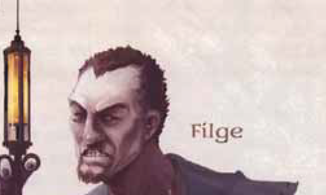

 Guide to Running The Whispering Cairn, Part 3

This part of the guide covers the interlude to put Alaster Land to rest. 

Part Three: Tomb Stories

-   The characters head back to the old Land farmstead with Alaster Land’s bones. Unfortunately, when they arrive, they find the graves have been robbed, and a wounded owlbear occupies the abandoned farmhouse
-   There are 5 gravesites, all empty:
    -   Anders Land (531 CY - 564 CY)
    -   Bermissa Land ((534-576 CY)
    -   Coldaran Land (550-576 CY)
    -   Gertia Land (564-576 CY)
    -   Alastor Land (552-? CY)
-   A DC 9 Intelligence (Investigation) or Wisdom (Perception) check reveals wheelbarrow tracks leaving the gravesites and heading towards Diamond Lake.
-   Inside the farmhouse is a wounded owlbear with 50 hp that immediately attacks anyone who enters.
-   A baby owlbear, only a few months old, hides in the back of the hut. It will latch onto the first character to show it kindness. Baby owlbears can be sold for as much as 3000 gp. If the characters choose to keep it, it will be a handful.
-   A DC 10 Wisdom (Perception) check discovers a dismembered arm with a tattoo. A DC 13 Intelligence (Investigation) check remembers it is the symbol of a mine manager who was driven out of business just over a year ago by Balabar Smenk. Another DC 13 Intelligence (Investigation) check recalls gang members often hang out at the Feral Cock.

Part Four: The Feral Cock

-   The graverobbers (4 **thugs**) are holed up here, led by an albino half-orc **berserker** named Kullen. All have tattoos that match the severed arm.
-   Balabar Smenk asked Kullen to go to Filge and give him whatever help he needed, and he wanted corpses. Kullen resented the ask, but is in debt to Balabar. He’s initially indifferent to the characters, but can be persuaded or intimidated into giving the characters information. Alternatively, the characters can just beat it out of him.
-   Kullen has a _**potion of healing**_ in his possession, along with 9 gp.
-   If characters can’t get information about Filge and his observatory the first time, Kullen and his thugs will look to ambush them later.

  

  

Part 5: The Observatory

1.  Landing
    -   Summary: Small tool closet with a crawling claw, locked door into the observatory.
    -   Checks: DC 12 Dexterity (Sleight of Hand) to pick the lock. Failure by 5 or more alerts the skeletons in the next room, as does bashing the lock.
    -   Threats: **Crawling claw** in the tool closet.
    -   Developments: If the characters make too much noise, the skeletons in the next room will have an advantage on initiative.
2.  Watchers In the Dark
    -   Summary: Animated skeletons from the Land’s remains take cover behind a table and attack the characters in a debris-filled room.
    -   Checks: DC 12 Wisdom (medicine) check to identify marks of the Red Death plague, meaning these remains match the cause of death of the Land family.
    -   Threats: All squares are difficult terrain. Three **skeletons** attack the party.
3.  Abandoned Office
4.  Cenobitic Chambers
    
    -   Checks: A DC 15 Intelligence (Investigation) check in one of the chambers finds a pouch hidden behind a drawer with 6 pp and 5 gp.
    
5.  Feasting Hall
    -   Summary: A zombified feast hall is set for a dinner party. If a character sits at the head of the table, the zombies act out a lavish dinner party.
    -   Treasure: The full set of silverware is worth 200 gp.
6.  Kitchen
7.  Pantry
8.  Storage Closet
9.  Bedchamber
    -   Summary: Filge’s bedchamber, filled with eccentricities. Accessible via stairs or windows from the roof of the attached observatory building. Filge is present here from 2 am until noon. each day. His owl keeps watch while he sleeps. The head also has a _**magic mouth**_ cast on it to scream “Intruder!” if touched.
    -   Treasure: Syringes that function as the following potions: Healing, Comprehension, and Water Breathing.
    -   Developments: A handout with the note Smenk sent to Filge is also in the room.
10.  Closet
11.  Operating Theatre
     -   Summary: Filge’s laboratory, where he is trying to create a powerful new zombie.
     -   Checks:
     -   Threats: For Filge, use a **Necromancer Wizard** without _circle of death_ or _summon undead_. The creatures in the vats are three **zombies** and one **Strahd zombie**. The **skeleton** of Gertia Land also protects Filge. He has a syringe that acts as a **potion of false life**, and has already cast mage armor and mage hand when the PCs enter the room.
     -   Treasure: Filge has operating instruments worth 500 gp. There is also a 20 gp emerald embedded in the corpse. Lastly, there is a worm of Kyuss embedded in embalming fluid.
     -   Developments: Filge quickly spills his guts if intimidated or persuaded.
         -   Balabar recruited him from the Free City for his undead expertise. Something is going on in the Dourstone mine involving cultists of the Ebon Triad and undead. Smenk is scared of the place, and that scares Filge.
         -   He stole the skeletons because he needed helpers and had no idea who they were.
         -   The Cult of the Ebon Triad follows Hextor, Erthynul, and Vecna all at once.
         -   The worm likely once belonged to a spawn of Kyuss - a kind of zombie, and likely the “unkillable undead” Balabar was talking about.
         -   No one knows much about Kyusss. It is said he appeared in a Rift Canyon far to the north and had an undead dragon general. Only his worms remain, along with his title: Harbinger of the Age of Worms.
