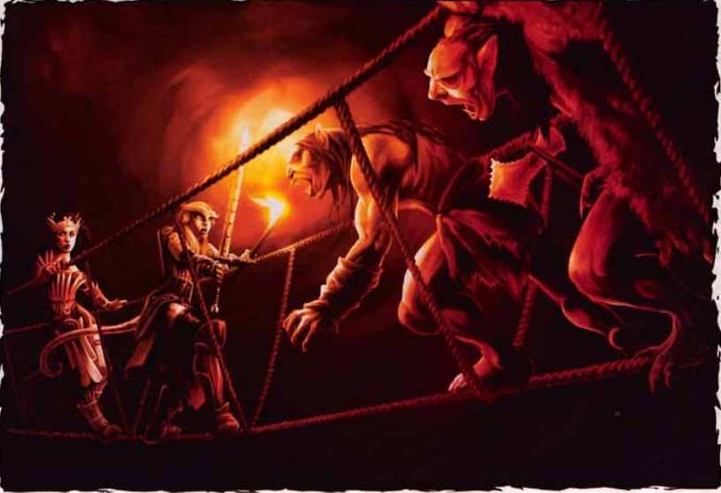

 Part 3: The Cave of Erythnul

There are no light sources in the caves, and the ground is difficult terrain everywhere.

  
  

1.  Stone Forest
    -   Summary: Entry area guarded by grimlocks who attack anyone who does not announce themselves.
    -   Checks: DC 15 Wisdom (Perception) to see the hiding grimlocks.
    -   Threats: 3 **grimlocks**
2.  The Ledge
    -   Summary. A semi-circular room that ends in a sheer drop-off that leads to the grimlock’s main lair. The grimlocks who hide here want the characters to descend the rock ladder over the ledge towards area 14 so they can ambush them.
    -   Checks: None
    -   Threats: 1 **grimlock scalphunter** from MME and 2 **giant hyena** with a frightening shriek ability (DC 12 WIS save or frightened until the end of the next turn)
    -   Rewards: A search of the grimlock’s campsite turns up a 200 gp ruby.
3.  Descent into the Dark
    -   Summary: Spikes are carved into the cavern walls to allow characters to descend to the cave floor, and another leads to the ledge where the grimlock snipers hide.
    -   Checks: DC 12 Strength (Athletics) or Dexterity (Acrobatics) to descend or ascend the spikes.
    -   Threats: 2 **Archers** with blindsight 90 ft.
    -   Rewards: Ivory dice worth 30 gp.
4.  The Tunnel
    -   Summary: A tunnel occupied by a grimlock warrior.
    -   Checks: none
    -   Threats: A **grimlock brute** from MME.
    -   Rewards: In a bag at the grimlock’s waist is the head of a female drow, a potion of cure light wounds, and 200 gp.
5.  Choker Tunnels
    -   Summary: Another way through that passes by refuse piles and lurking chokers.
    -   Threats: 2 **chokers**
    -   Notes: Extraneous encounter worth skipping.
6.  The Bridge
    -   Summary: A swinging rope bridge connects to a ledge.
    -   Checks: DC 12 Dexterity Saving Throw to avoid falling off the bridge when someone takes a full round action to shake it.
    -   Threats: 3 grimlocks, each also has a ranged javelin attack.
    -   Rewards: Another encounter worth skipping.
7.  Cliff Chamber
    -   Summary: Entry cave with grimlock sentries
    -   Checks: Characters have advantage on a group DC 13 Dexterity (stealth) check to surprise the grimlocks
    -   Threats: 2 **grimlocks**
    -   Rewards: None
    -   Developments: Grimlocks in area 19 respond to the sounds of battle in round 2, while the chieftan in area 20 arrives on round 3.
8.  Common Chamber
    -   Summary: Grimlock's sleeping chambers
    -   Checks: DC 15 Intelligence (Investigation) check to find a cache of treasure (see rewards)
    -   Threats: 6 **grimlocks**
    -   Rewards: 
    
    -   Treasure cache:
        -   Jade figurine of Erthynul worth 100 gp
        -   50 gp
        -   3 garnets worth 50 gp each
        -   silver necklace set with 3 gems worth 300 gp
    
9.  Chieftain’s Lodge
    -   Summary: Chieftan sits in his room eating trippy mushrooms
    -   Threats: 1 **Grimlock Chieftain** from MME
    -   Rewards: 4 100 gp rubies, 150 gp in gold, and a _Heward’s Handy Haversack._
10.  Temple to Erythnul
     -   Summary: Gralluck Kur, a priest of Erythnul, crouches here, throwing mushrooms into a fire.
     -   Checks:
         -   DC 13 Constitution save for anyone who comes within 10 feet of the fire. Failure inflicts the _**poisoned**_ condition from the hallucinogenic mushrooms Gralluck is tossing in the fire.
         -   DC 15 Intelligence (Investigation) to find Gralluck’s Treasure.
         -   DC 13 Intelligence (Investigation) check to decipher Gralluck’s notes.
     -   Threats: 3 **grimlock brutes** defend Gralluck Kur, a **grimlock shaman**
     -   Rewards: 500 gp, a 200 gp statue of Lolth, and a _rope of climbing_
     -   Development: Read the passage from the end of the section when the characters decipher the cleric’s note presaging the Age of Worms.
