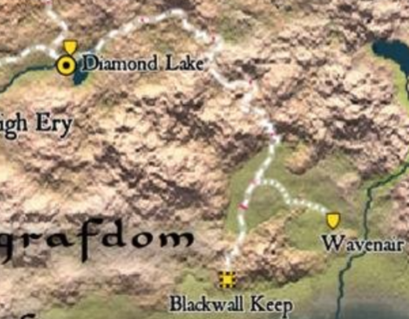

This is a prerty rough outline of the third adventure in the adventure path. It is a fine adventure, and an important connector to the rest of the path, but nothing stands out about it. The siege is fun as its a good chance for players to whip out their 5th level powers. I think the lizardfolk lair would not be fun if the characters took the murder hobo approach. I led them towards sick lizardfolk, and set it up so they just had to fight the chieftan then deal with Ilthane's kobolds. The Spawn is a good capper, and players will be petrified of the worms which creates great tension. On to the guide...

## Outline

1.  Call to Action
2.  Random encounters while travelling
3.  Siege of Blackwall Keep
4.  Exploring the Mistmarsh
5.  Lizardfolk Camp
6.  Return to Blackwall Keep and deal with Spawn of Kyuss

Oerth Map: [https://www.annabmeyer.com/576cy-easyzoom/](https://www.annabmeyer.com/576cy-easyzoom/)

## Call to Action

Allustan needs to visit the wizard Marzena at Blackwell Keep to discuss her report of disturbing green worms they have been finding. It's dangerous enough that he needs an escort.

Marzena might be a friend, relative, or confidant of one of the characters.

The first random encounter rolled will be with lizardfolk. The key information they can provide is that another tribe, the Twisted Branch, is preparing for war with someone.

I used the One Ring journey rules to travel to Blackwall Keep, and then used the travel rules from [The Last Travel Book You Will Ever Need](https://www.dmsguild.com/en/product/549589/the-last-travel-book-you-will-ever-need) to cross the Mistmarsh. I might do a separate post about Journey rules later. 

  

## The Siege of Blackwall Keep

-   Flies and smoke signal the siege up ahead.
-   30 Lizardfolk [scaleshields](https://www.dndbeyond.com/monsters/313030-lizardfolk-scaleshield) surround the keep with 2 of their leaders, a [Geomancer](https://www.dndbeyond.com/monsters/5195107-lizardfolk-geomancer) named Shest and a [Render](https://www.dndbeyond.com/monsters/313028-lizardfolk-render) named Kushak.
-   They are split into 6 groups of 5.
-   Two groups break down the door.
-   Two groups try to climb the tower
-   Two groups remain in reserve
-   A group of lizardfolk are already leaving, dragging prisoners with them.
-   Will fight till 20 are dead, or 10 and Kushak.
-   Marzena was among the prisoners dragged away.
-   There is nothing of interest in the keep besides the locked door to the basement

### Captain **Edrin Kallus**, Ranking Member of the Blackwall Keep Guard

-   **Age:** 42 | **Service:** 19 years
-   **Reputation:** “Keeps the wall standing.”
-   **Temperament:** Controlled, blunt, distrusts outsiders—respects results.
-   **Tell:** Rubs a scar on his jaw when weighing a decision.
-   Lawful Neutral **veteran**

Second son of a river ferryman conscripted after bandits burned his village. Rose through the ranks by logistics and discipline, not heroics. Knows Blackwall’s supply routes, marsh patrol schedules, and which stones in the wall settle after rain.

## Lizardfolk Lair

The dungeon is dark for the most part, and characters without darkvision will need light sources.

1.  Concealed Entrance
    1.  Summary: Concealed main entrance to the lair
    2.  Checks: DC 13 Intelligence (investigation) check to find the entrance, unless characters see lizardfolk entering or exiting.
2.  Alcove
    1.  Summary: Small alcove with water and refreshments for lizardfolk patrols
3.  Compost Pile
    1.  Summary: Lizardfolk compost pile hiding and assassin vine.
    2.  Checks: DC 13 Wisdom (Perception) to spot the vine.
    3.  Threats: One **assassin vine**
    4.  Notes: This is a very cuttable encounter.
4.  Harpy Nest
    1.  Summary: A nest of harpies with an exit to the outside.
    2.  Threats: Two **harpies**
    3.  Development: Harpies will only be present during the day; at night they hunt.
    4.  Treasure:
    5.  Notes: Also cuttable
5.  Garbage Room
    1.  Summary: Garbage room and home of the tribe’s pet Otyugh.
    2.  Checks: DC 15 Wisdom (Nature) to identify mushrooms as potentially helpful, not poisonous.
    3.  Threats: **Otyugh**
    4.  Rewards: Mushrooms can be turned into _**potions of vitality**_ with DC 20 Wisdom (Nature) check. Failing by 5 or more results in a _**potion of poison.**_ 1d4 mushrooms can be harvested.
6.  Lizard Lairs
    1.  Summary: Connected rooms that serve as living quarters for the lizardfolk.
    2.  Checks: DC 15 Wisdom (Medicine) check to determine that one lizardfolk is infected with a slow Kyuss worm. A _remove curse_ followed by a _lesser restoration_ is required to cure the creature.
    3.  Threats: There are a total of 21 lizardfolk spread throughout the caverns. Lazardfolk default to indifferent, but can easily turn hostile towards invaders.
    4.  Rewards: The lizard folk have a total of 113 gp spread amongst them.
    5.  Development: if the characters cure the sick lizardfolk, the other react strongly, as the worms are the same ones that crawled out of the last clutch of corrupted eggs.
7.  Lieutenant and Prisoners
    1.  Summary: Lieutenant Kotabas and his mate question captives from the keep.
    2.  Threats: Kotabas is a **lizardfolk Sovereign,** and his mate is a normal **lizardfolk.**
    3.  Development: Kotabas is violent and a true follower of Ilthane. He will kill the captives to mess with the characters.
8.  Shaman and Prisoners
    1.  Summary: The tribe’s shaman, Hiska, is here, along with a soldier prisoner and Marzena. Hishka will negotiate and wants to rid the tribe of its aggressive leaders, especially given evidence of the slow worms.
    2.  Checks: DC 13 Charisma (Persuasion) check to move Hishka from Indifferent to Friendly.
    3.  Threats: Hishka is a **lizardfolk shaman** who has a **giant constrictor snake** as a pet.
    4.  Rewards: Hiska gives characters tortoise shield +1 if they defeat Shukak and figure out what is wrong with the eggs. n
    5.  Development: If characters can convince Hishka they want to help, he will organise a gathering of the tribe to allow the characters to speak and confront Shuhak. He will also allow the characters to heal Marzena.
9.  Lair of the Lizard King
    1.  Summary: Lair of Shukak, the lizardfolk king, who will immediately challenge the characters to battle.
    2.  Threats: **Lizardfolk Champion** and 3 **blackscale bruisers** from MME
    3.  Rewards: Shukak wears Marzena’s _ring of protection._ He also has her _wand of magic missiles_ hidden in his thrown. If presented with the items after being saved, she offers the characters to take one of the two items as a reward.
    4.  Development: Shukak was recruited by the black dragon Ilthane during his time as a gladiator in the Free City.
10.  Submerged Tunnel
     1.  Summary: Trapped, submerged tunnel leading to the tribe’s eggs.
     2.  Checks: DC 13 Strength (Athletics) to swim through the tunnel. DC 15 Wisdom (Perception) to spot the various snares in the tunnel.
     3.  Threats: Snares restrain characters until they succeed on a DC 15 Strength (Athletics) or DC 15 Dexterity (Acrobatics) check to free themselves.
     4.  Development: See [Suffocation](https://www.dndbeyond.com/sources/dnd/phb-2024/rules-glossary#SuffocationHazard) rules.
11.  Kobold Guardians
     1.  Summary: A clutch of black scaled kobolds sent by Ilthane to guard the corrupted eggs.
     2.  Threats: 8 Kobold Scale Sorcerers with black scales that do acid damage and know M_elf’s acid arrow_ instead of Ievitate.
     3.  Rewards: 4 **potions of healing**, each containing a slow worm. A worm can be spotted with a DC 15 Wisdom (Perception) check. A creature who swallows a slow worm must make a DC 15 Constitution save each day or lose 1d4 points of Constitution. Any creature that reaches 0 Constitution becomes a spawn of Kyuss. Curing a character infected by a slow worm requires the _greater restoration_ spell.
12.  Egg Chamber
     1.  Summary: This chamber contains hundreds of lizardfolk eggs, as well as a large egg that looks like a black dragon’s egg.
     2.  Threats: The egg looks like a black dragon’s egg, but instead contains hundreds of Kyuss worms meant to infect the lizardfolk’s eggs. The egg is vulnerable to fire or cold damage. Any other damage releases the worms. Infected eggs produce a juvenile **spawn of Kyuss** with 1 hit point.
     3.  Rewards: A sunken chest containing 5,320 sp, 1,930 gp, 21 pp, two _**potions of healing (greater), a potion of haste, and a potion of invi**_s_**ibility.**_ Each potion is infected with a slow Kyuss worm.
     4.  Development: Destroying the egg with fire produces a paste that can be used to make Kyuss Worm Paste or Kyussbane Oil. Helping protect the eggs earns a truce with the lizardfolk - letting them get destroyed means the characters must fight their way out of the lair, and the Twisted Branch becomes a constant threat to Blackwall Keep and Diamond Lake.
13.  Large Submerged Tunnel
     1.  Summary: The tunnel Ilthane uses to enter and exit the area.

Once back at Blackwall Keep, characters must deal with 3 **Spawn of Kyuss** attacking everyone in the keep.

Once the characters return to Allustan, he tells them they should go visit his friend Eligos in the Free City for more information on the worms.
